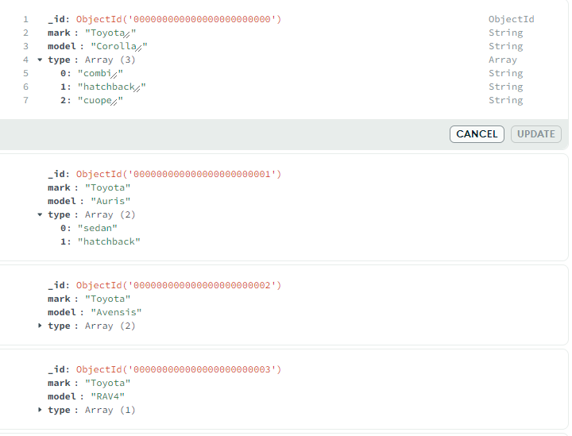
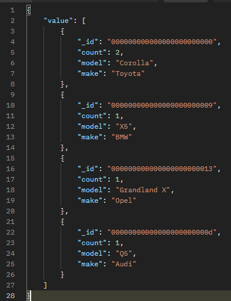

<style>
code {
    font-size: 1em; /* Ustawienie rozmiaru czcionki */
}
pre code {
    font-size: 0.65em; /* Ustawienie rozmiaru czcionki w blokach kodu */
}
</style>

# Projekt systemu do wypożyczania aut

## Kluza Łukasz i Mateusz Sacha

### 1. Schemat Bazy Danych i konfiguracja aplikacji

#### 1.1 CarsModels



#### 1.2 Cars


#### 1.3 Clients


#### 1.4 Rentals


#### 1.5 Startup.cs

```csharp
public class Startup
{
    public Startup(IConfiguration configuration)
    {
        Configuration = configuration;
    }

    public IConfiguration Configuration { get; }

    public void ConfigureServices(IServiceCollection services)
    {   

        services.AddControllersWithViews()
            .AddJsonOptions(options =>
            {
                options.JsonSerializerOptions.Converters.Add(new ObjectIdJsonConverter());
                options.JsonSerializerOptions.DefaultIgnoreCondition = JsonIgnoreCondition.WhenWritingNull;
            });

        var jwtSettings = Configuration.GetSection("Jwt");
        var key = Encoding.ASCII.GetBytes(jwtSettings["Key"]);

        services.AddAuthentication(options =>
        {
            options.DefaultAuthenticateScheme = JwtBearerDefaults.AuthenticationScheme;
            options.DefaultChallengeScheme = JwtBearerDefaults.AuthenticationScheme;
        })
        .AddJwtBearer(options =>
        {
            options.TokenValidationParameters = new TokenValidationParameters
            {
                ValidateIssuer = true,
                ValidateAudience = true,
                ValidateLifetime = true,
                ValidateIssuerSigningKey = true,
                ValidIssuer = jwtSettings["Issuer"],
                ValidAudience = jwtSettings["Audience"],
                IssuerSigningKey = new SymmetricSecurityKey(key)
            };
        });

        services.AddAuthorization(options =>
        {
            options.AddPolicy("AuthenticatedUser", policy =>
                policy.RequireAuthenticatedUser());
        });

        services.AddControllersWithViews();
        services.AddCors(options =>
        {
            options.AddPolicy("AllowAllOrigins",
                builder =>
                {
                    builder.AllowAnyOrigin()
                        .AllowAnyMethod()
                        .AllowAnyHeader();
                });
        });
        services.AddControllers();

        services.AddSingleton<MongoDbContext>();

        services.AddScoped<ICarService, CarService>();
        services.AddScoped<ICarsModelsService, CarsModelsService>();
        services.AddScoped<IRentalService, RentalService>();
        services.AddScoped<IClientService, ClientService>();
        services.AddScoped<IStatisticsService, StatisticsService>();

        services.AddScoped<IMongoCollection<Car>>(provider =>
        {
            var dbContext = provider.GetRequiredService<MongoDbContext>();
            return dbContext.GetCollection<Car>("Cars");
        });
        services.AddScoped<IMongoCollection<CarModel>>(provider =>
        {
            var dbContext = provider.GetRequiredService<MongoDbContext>();
            return dbContext.GetCollection<CarModel>("CarsModels");
        });
        services.AddScoped<IMongoCollection<Rental>>(provider =>
        {
            var dbContext = provider.GetRequiredService<MongoDbContext>();
            return dbContext.GetCollection<Rental>("Rentals");
        });
        services.AddScoped<IMongoCollection<Client>>(provider =>
        {
            var dbContext = provider.GetRequiredService<MongoDbContext>();
            return dbContext.GetCollection<Client>("Clients");
        });
    }

    public void Configure(IApplicationBuilder app, IWebHostEnvironment env)
    {
        if (env.IsDevelopment())
        {
            app.UseDeveloperExceptionPage();
        }
        else
        {
            app.UseExceptionHandler("/Home/Error");
            app.UseHsts();
        }
        
        app.UseHttpsRedirection();
        app.UseStaticFiles();

        app.UseCors("AllowAllOrigins");

        app.UseRouting();

        app.UseAuthentication();
        app.UseAuthorization();

        app.UseEndpoints(endpoints =>
        {
            endpoints.MapControllers();
        });
    }
}
```

### 2. Opis Serwisów
Serwisy w C# to klasy, które wykonują różnorodne operacje na danych w aplikacji. Ich główną rolą jest oddzielenie tych operacji od pozostałych części aplikacji, co przynosi korzyści w zarządzaniu, testowaniu i ponownym wykorzystaniu kodu.

#### 2.1 Car Service

##### 2.1.1 Create Car
Metoda asynchroniczna służąca do tworzenia nowych samochodów w bazie danych. W przypadku nieudanej operacji metoda rzuca wyjątki.

Parametry:
- Car car - obiekt typu Car, który ma zostać dodany do kolekcji.

```csharp
public async Task CreateCarAsync(Car car)
{
    try
    {
        _logger.LogInformation("Attempting to create car: {@Car}", car);
        if (_carCollection == null)
        {
            _logger.LogError("Car collection is null");
            return;
        }
        await _carCollection.InsertOneAsync(car);
        _logger.LogInformation("Car created successfully: {@Car}", car);
    }
    catch (Exception ex)
    {
        _logger.LogError(ex, "An error occurred while creating the car");
        throw;
    }
}
```

##### 2.1.2 Update Car
Metoda asynchroniczna służąca do aktualizacji istniejących samochodów w bazie danych. Sprawdza, czy dany samochód istnieje, a następnie dokonuje aktualizacji.

Parametry:
- ObjectId id - identyfikator samochodu do zaktualizowania.
- Car car - obiekt typu Car z nowymi danymi.

```csharp
public async Task<bool> UpdateCarAsync(ObjectId id, Car car)
{
    try
    {
        var filter = Builders<Car>.Filter.Eq(car => car._id, id);
        
        var originalCar = await _carCollection.Find(filter).FirstOrDefaultAsync();

        if (originalCar == null)
        {
            _logger.LogWarning($"Car with ID '{id}' not found.");
            return false;
        }

        car._id = originalCar._id;

        var result = await _carCollection.ReplaceOneAsync(filter, car);

        if (result.ModifiedCount > 0)
        {
            _logger.LogInformation($"Car with ID '{id}' updated successfully.");
            return true;
        }
        else
        {
            _logger.LogWarning($"Car with ID '{id}' not found.");
            return false;
        }
    }
    catch (Exception ex)
    {
        _logger.LogError($"An error occurred while updating the car: {ex.Message}");
        throw;
    }
}
```

##### 2.1.3 Delete Car
Metoda asynchroniczna służąca do usuwania samochodów z bazy danych na podstawie ich identyfikatora.

Parametry:
- ObjectId id - identyfikator samochodu do usunięcia.

```csharp
public async Task<bool> DeleteCarAsync(ObjectId id)
{
    try
    {
        var filter = Builders<Car>.Filter.Eq(car => car._id, id);
        var result = await _carCollection.DeleteOneAsync(filter);
        if (result.DeletedCount > 0)
        {
            _logger.LogInformation($"Car with ID '{id}' deleted successfully.");
            return true;
        }
        else
        {
            _logger.LogWarning($"Car with ID '{id}' not found.");
            return false;
        }
    }
    catch (Exception ex)
    {
        _logger.LogError($"An error occurred while deleting the car: {ex.Message}");
        throw;
    }
}
```

##### 2.1.4 Get Cars Per Filter
Metoda asynchroniczna służąca do pobierania listy samochodów spełniających określone kryteria.

Parametry:
- FilterDefinition\<Car> filter - filtr używany do wyszukiwania samochodów.

```csharp
public async Task<IEnumerable<Car>> GetCarsPerFilterAsync(FilterDefinition<Car> filter)
{
    try
    {
        var jsonFilter = filter.Render(BsonSerializer.SerializerRegistry.GetSerializer<Car>(), BsonSerializer.SerializerRegistry);
        _logger.LogInformation($"Generated Filter: {jsonFilter}");
        var result = await _carCollection.Find(filter).ToListAsync();
        return result;
    }
    catch (Exception ex)
    {
        _logger.LogError($"An error occurred while retrieving cars: {ex.Message}");
        throw;
    }
}
```

##### 2.1.5 Get Car By ID
Metoda asynchroniczna służąca do pobierania samochodu na podstawie jego identyfikatora.

Parametry:
- ObjectId id - identyfikator samochodu do pobrania.

```csharp
public async Task<Car> GetCarByIdAsync(ObjectId id)
{
    var filter = Builders<Car>.Filter.Eq(car => car._id, id);
    var car = await _carCollection.Find(filter).FirstOrDefaultAsync();
    return car;
}
```

##### 2.1.6 Update Car Availability By ID
Metoda asynchroniczna służąca do aktualizacji statusu dostępności samochodu.

Parametry:
- ObjectId id - identyfikator samochodu do zaktualizowania.
- bool availability - nowy status dostępności samochodu.

```csharp
public async Task<bool> UpdateCarAvailabilityByIdAsync(ObjectId id, bool availability)
{
    try
    {
        var car = await GetCarByIdAsync(id);

        if (car == null)
        {
            _logger.LogError($"Car {id} not exist");
            return false;
        }

        car.IsAvailable = availability;
        var updateResult = await UpdateCarAsync(id, car);

        return updateResult;
    }
    catch (Exception ex)
    {
        _logger.LogError($"An error occurred while uptating car availability: {ex.Message}");
        return false;
    }
}
```

##### 2.1.7 Update Current Mileage
Metoda asynchroniczna służąca do aktualizacji przebiegu samochodu.

Parametry:
- ObjectId id - identyfikator samochodu do zaktualizowania.
- int mileage - nowy przebieg samochodu.

```csharp
public async Task<bool> UpdateCurrentMileageAsync(ObjectId id, int mileage)
{
    try
    {
        var filter = Builders<Car>.Filter.Eq(car => car._id, id);
        var car = await _carCollection.Find(filter).FirstOrDefaultAsync();

        if (car == null)
        {
            _logger.LogError($"Car {id} not exist");
            return false;
        }

        car.Curr_mileage += mileage;
        var result = await UpdateCarAsync(id, car);
        return result;
    }
    catch (Exception ex)
    {
        _logger.LogError($"An error occurred while uptating car mileage: {ex.Message}");
        return false;
    }
}
```

#### 2.2 Cars Models Service

##### 2.2.1 Create Car Model
Metoda asynchroniczna służąca do tworzenia nowych modeli samochodów w bazie danych. Obsługuje operacje transakcyjne, zapewniając, że operacja zostanie wykonana w całości lub w ogóle.

Parametry:
- CarModel carModel - obiekt typu CarModel, który ma zostać dodany do kolekcji.

```csharp
public async Task CreateCarModelAsync(CarModel carModel)
{
    try
    {
        _logger.LogInformation("Attempting to create car model: {@CarModel}", carModel);
        if (_carModelCollection == null)
        {
            _logger.LogError("Cars models collection is null");
            return;
        }
        await _carModelCollection.InsertOneAsync(carModel);
        _logger.LogInformation("Car model created successfully: {@CarModel}", carModel);
    }
    catch (Exception ex)
    {
        _logger.LogError(ex, "An error occurred while creating the car model");
        throw;
    }
}
```

##### 2.2.2 Update Car Model
Metoda asynchroniczna służąca do aktualizacji istniejących modeli samochodów w bazie danych. Sprawdza, czy dany model samochodu istnieje, a następnie dokonuje aktualizacji.

Parametry:
- ObjectId id - identyfikator modelu samochodu do zaktualizowania.
- CarModel carModel - obiekt typu CarModel z nowymi danymi.

```csharp
public async Task<bool> UpdateCarModelAsync(ObjectId id, CarModel carModel)
{
    try
    {
        var filter = Builders<CarModel>.Filter.Eq(carModel => carModel._id, id);
        
        var originalCarModel = await _carModelCollection.Find(filter).FirstOrDefaultAsync();

        if (originalCarModel == null)
        {
            _logger.LogWarning($"Car model with ID '{id}' not found.");
            return false;
        }

        carModel._id = originalCarModel._id;

        var result = await _carModelCollection.ReplaceOneAsync(filter, carModel);

        if (result.ModifiedCount > 0)
        {
            _logger.LogInformation($"Car model with ID '{id}' updated successfully.");
            return true;
        }
        else
        {
            _logger.LogWarning($"Car model with ID '{id}' not found.");
            return false;
        }
    }
    catch (Exception ex)
    {
        _logger.LogError($"An error occurred while updating the car model: {ex.Message}");
        throw;
    }
}
```

##### 2.2.3 Delete Car Model
Metoda asynchroniczna służąca do usuwania modeli samochodów z bazy danych na podstawie ich identyfikatora.

Parametry:
- ObjectId id - identyfikator modelu samochodu do usunięcia.

```csharp
public async Task<bool> DeleteCarModelAsync(ObjectId id)
{
   try
   {
        var filter = Builders<CarModel>.Filter.Eq(carModel => carModel._id, id);
        var result = await _carModelCollection.DeleteOneAsync(filter);
        if (result.DeletedCount > 0)
        {
            _logger.LogInformation($"Car model with ID '{id}' deleted successfully.");
            return true;
        }
        else
        {
            _logger.LogWarning($"Car model with ID '{id}' not found.");
            return false;
        }
   }
   catch (Exception ex)
   {
        _logger.LogError($"An error occurred while deleting the car model: {ex.Message}");
        throw;
   }
}
```

##### 2.2.4 Get Cars Models Per Filter
Metoda asynchroniczna służąca do pobierania listy modeli samochodów spełniających określone kryteria.

Parametry:
- FilterDefinition\<CarModel> filter - filtr używany do wyszukiwania modeli samochodów.

```csharp
public async Task<IEnumerable<CarModel>> GetCarsModelsPerFilterAsync(FilterDefinition<CarModel> filter)
{
    try
    {
        var result = await _carModelCollection.Find(filter).ToListAsync();
        return result;
    }
    catch (Exception ex)
    {
        _logger.LogError($"An error occurred while retrieving cars models: {ex.Message}");
        throw;
    }
}
```

##### 2.2.5 Get Car Model By ID
Metoda asynchroniczna służąca do pobierania modelu samochodu na podstawie jego identyfikatora.

Parametry:
- ObjectId id - identyfikator modelu samochodu do pobrania.

```csharp
public async Task<CarModel> GetCarModelByIdAsync(ObjectId id)
{
    var filter = Builders<CarModel>.Filter.Eq(carModel => carModel._id, id);
    var carModel = await _carModelCollection.Find(filter).FirstOrDefaultAsync();
    return carModel;
}
```

#### 2.3 Client Service

##### 2.3.1 Create Client
Metoda asynchroniczna służąca do tworzenia nowych klientów w bazie danych. Obsługuje operacje transakcyjne, zapewniając, że operacja zostanie wykonana w całości lub w ogóle.

Parametry:
- Client client - obiekt typu Client, który ma zostać dodany do kolekcji.

```csharp
public async Task CreateClientAsync(Client client)
{
    try
    {
        _logger.LogInformation("Attempting to create client: {@Client}", client);
        if (_clientCollection == null)
        {
            _logger.LogError("Clients collection is null");
            return;
        }
        await _clientCollection.InsertOneAsync(client);
        _logger.LogInformation("Client created successfully: {@Client}", client);
    }
    catch (Exception ex)
    {
        _logger.LogError(ex, "An error occurred while creating client");
        throw;
    }
}
```

##### 2.3.2 Delete Client
Metoda asynchroniczna służąca do usuwania klientów z bazy danych na podstawie ich identyfikatora.

Parametry:
- ObjectId id - identyfikator klienta do usunięcia.

```csharp
public async Task<bool> DeleteClientAsync(ObjectId id)
{
    try
    {
        var filter = Builders<Client>.Filter.Eq(client => client._id, id);
        var result = await _clientCollection.DeleteOneAsync(filter);
        if (result.DeletedCount > 0)
        {
            _logger.LogInformation($"Client with ID '{id}' deleted successfully.");
            return true;
        }
        else
        {
            _logger.LogWarning($"Client with ID '{id}' not found.");
            return false;
        }
    }
    catch(Exception ex)
    {
        _logger.LogError($"An error occurred while deleting the client: {ex.Message}");
        throw;
    }
}
```

##### 2.3.3 Get Clients Per Filter
Metoda asynchroniczna służąca do pobierania listy klientów spełniających określone kryteria.

Parametry:
- FilterDefinition\<Client> filter - filtr używany do wyszukiwania klientów.

```csharp
public async Task<IEnumerable<Client>> GetClientsPerFilterAsync(FilterDefinition<Client> filter)
{
    try
    {
        var jsonFilter = filter.Render(BsonSerializer.SerializerRegistry.GetSerializer<Client>(), BsonSerializer.SerializerRegistry);
        _logger.LogInformation($"Generated Filter: {jsonFilter}");
        var result = await _clientCollection.Find(filter).ToListAsync();
        return result;
    }
    catch (Exception ex)
    {
        _logger.LogError($"An error occurred while retrieving clients: {ex.Message}");
        throw;
    }
}
```

##### 2.3.4 Get User By Email
Metoda asynchroniczna służąca do pobierania klienta na podstawie jego adresu e-mail.

Parametry:
- string email - adres e-mail klienta do pobrania.

```csharp
public async Task<Client> GetUserByEmailAsync(string email)
{
    try 
    {
        var result = await _clientCollection.Find(client => client.Email == email).FirstOrDefaultAsync();
        return result;
    }
    catch(Exception ex)
    {
        _logger.LogError($"An error occurred while retrieving client: {ex.Message}");
        throw;
    }
}
```

##### 2.3.5 Update Client
Metoda asynchroniczna służąca do aktualizacji istniejących klientów w bazie danych. Sprawdza, czy dany klient istnieje, a następnie dokonuje aktualizacji.

Parametry:
- ObjectId id - identyfikator klienta do zaktualizowania.
Client client - obiekt typu Client z nowymi danymi.

```csharp
public async Task<bool> UpdateClientAsync(ObjectId id, Client client)
{
    try
    {
        var filter = Builders<Client>.Filter.Eq(client => client._id, id);
        
        var originalClient = await _clientCollection.Find(filter).FirstOrDefaultAsync();

        if (originalClient == null)
        {
            _logger.LogWarning($"Client with ID '{id}' not found.");
            return false;
        }

        client._id = originalClient._id;

        var result = await _clientCollection.ReplaceOneAsync(filter, client);

        if (result.ModifiedCount > 0)
        {
            _logger.LogInformation($"Client with ID '{id}' updated successfully.");
            return true;
        }
        else
        {
            _logger.LogWarning($"Client with ID '{id}' not found.");
            return false;
        }
    }
    catch (Exception ex)
    {
        _logger.LogError($"An error occurred while updating the client: {ex.Message}");
        throw;
    }
}
```

##### 2.3.6 Update Rental Days
Metoda asynchroniczna służąca do aktualizacji liczby dni wypożyczeń klienta w bazie danych. Pobiera aktualną liczbę dni wypożyczeń i dodaje nowe dni.

Parametry:
- ObjectId id - identyfikator klienta.
- int rental_days - liczba dni wypożyczeń do dodania.

```csharp
public async Task<bool> UpdateRentalDaysAsync(ObjectId id, int rental_days)
{
    try
    {
        var filter = Builders<Client>.Filter.Eq(client => client._id, id);
        Client client = await _clientCollection.Find(filter).FirstOrDefaultAsync();

        if (client == null)
        {
            _logger.LogError($"Client {id} does not exist");
            return false;
        }

        client.Total_Rental_Days += rental_days;
        var result = await UpdateClientAsync(id, client);
        return result;
    }
    catch (Exception ex)
    {
        _logger.LogError($"An error occurred while updating client rental days: {ex.Message}");
        return false;
    }
}
```

#### 2.4 Rental Service

##### 2.4.1 New Rental
Służy do asynchronicnzego tworzenia nowych wypożyczeń, zapytanie to jest stworzene w modelu transakcyjnym co oznacza, że wykonuje się ono albo w całości albo w ogóle.
Przyjmuje on jako parametr obiekt typu _Rental_ i ralizuje kolejne operacje

- Zarządza transakcjami
```csharp
using (var session = await _client.StartSessionAsync())
{
  session.StartTransaction();
  try
  {
    await session.CommitTransactionAsync();
  }
  catch (Exception ex)
  {
    await session.AbortTransactionAsync();
    throw;
  }
}      
```
- Sprawda czy obiekt _Rental_ nie jest nulem
```csharp
if (rental == null)
{
  _logger.LogError("Rental model is null");
  throw new ArgumentNullException(nameof(rental), "Rental model cannot be null");
}
```

- Sprawdza czy auto które chcemy wypozyczyć istnieje i jest dostępne: 
```csharp
Car car = await _carService.GetCarByIdAsync(carID);
if(car == null)
{
  _logger.LogWarning($"Car with ID '{carID}' not found.");
  throw new KeyNotFoundException($"Car does not exist.");
}
if(!car.IsAvailable)
{
  _logger.LogWarning($"Car with ID '{carID}' is not available.");
  throw new KeyNotFoundException($"Car does not available.");
}
```

- Aktualizuje status dostępności auta:
```csharp
var res = await _carService.UpdateCarAvailabilityByIdAsync(carID, false);
if (!res){
  _logger.LogWarning($"Error: UpdateCarAvailabilityByIdAsync()");
  throw new KeyNotFoundException($"Error: UpdateCarAvailabilityByIdAsync()");
}
```

- Jeśli żaden wyjątek nie został rzucony i wszystko pobiegło pomyślnie to dodaje obiek _rental_ do bazy:
```csharp
await _rentalCollection.InsertOneAsync(rental);
_logger.LogInformation("Rental model created successfully: {@Rental}", rental);
```

##### 2.4. Finish Rental
Służy do asynchronicnzego końcenia obecnych wypożyczeń, zapytanie to jest stworzene w modelu transakcyjnym co oznacza, że wykonuje się ono albo w całości albo w ogóle.
Przyjmuje on jako parametr _id_ wyporzyczenia które chcemy zakończyć oraz obiekt typu _Rental_ i ralizuje kolejne operacje

- Zarządza transakcjami:
```csharp
using (var session = await _client.StartSessionAsync())
{
  session.StartTransaction();
  try
  {
    await session.CommitTransactionAsync();
  }
  catch (Exception ex)
  {
    await session.AbortTransactionAsync();
    throw;
  }
}      
```

- Spraawdza czy wyporzyczenie, które chcemy zakończyć istnieje:
```csharp
var filter = Builders<Rental>.Filter.Eq(rental => rental._id, id);
var originalRental = await _rentalCollection.Find(filter).FirstOrDefaultAsync();

if (originalRental == null || rental == null)
{
  _logger.LogWarning($"Rental with ID '{id}' not found.");
  throw new KeyNotFoundException($"Rental does not exist.");
}
```
- Tworzy zmienne pomocnicze
```csharp
Rental_Details orginal_rental_Details = originalRental.Rental_Details;
Rental_Details rental_Details = rental.Rental_Details;
Rental_Car rental_Car = rental.Rental_Car;
```
- Ustawia datę zakończenia wypożyczenia na obecną, oblicza liczbę rozpoczętnych dni wypożyczenia, aktualizuje status na _sinished_

```csharp
rental_Details.End_Date = DateTime.UtcNow;
rental_Details.Days = (int)Math.Ceiling((rental_Details.End_Date.Value - rental_Details.Start_Date).TotalDays);
rental_Details.Rental_Status = "finished";
```

- Oblicza karę umowną za każdy dodatkowy dzień wypożyczenia (doliczane jest dodatkowe 50% dziennej opłaty za dane auto):

```csharp
if(rental_Details.Days > orginal_rental_Details.Days)
{
  rental_Details.Extra_Days_Amount = (int)((rental_Details.Days - orginal_rental_Details.Days) * 0.5 * rental_Car.Price_Per_Day);
  rental_Details.Extra_Amount += rental_Details.Extra_Days_Amount;
}
```
- Oblicza karę umowną za każdą dodatkowo przejechaną milę (doliczane jest dodatkowe 0.5% dziennej opłaty za dane auto do dodatkowej każdej mili powyżej 150 za dzień):

```csharp
if(rental_Details.Mileage > orginal_rental_Details.Mileage)
{
  rental_Details.Extra_Mileage_Amount = (int)((orginal_rental_Details.Mileage - rental_Details.Mileage) * 0.005 * rental_Car.Price_Per_Day);
  rental_Details.Extra_Mileage_Amount += rental_Details.Extra_Mileage_Amount;
}
```
- Oblicza karę umowną za każdy brakujący galon paliwa (wymagamy aby przy zwrocie bag był zatankowany do pełna, za każdy brakujący galon doliczamy 5$):

```csharp
if(rental_Details.Extra_Fuel != null)
{
  rental_Details.Extra_Fuel_Amount = rental_Details.Extra_Fuel.Value * 5;
  rental_Details.Extra_Amount += rental_Details.Extra_Fuel_Amount;
}
```

- Oblicza końcowy koszt wypozyczenia z uwzględnieniem rabatu:
```csharp
  rental_Details.Final_Amount = (int)(rental_Details.Price * (1-orginal_rental_Details.Discount) + rental_Details.Extra_Amount);
```

- Aktualizuje dostępność zwrócenego medelu auta oraz sprawdza poprawnośc wykonania się operacji:
```csharp
var res = await _carService.UpdateCarAvailabilityByIdAsync(rental_Car.carId, true);
if (!res)
{
  _logger.LogWarning($"Error: UpdateCarAvailabilityByIdAsync()");
  throw new KeyNotFoundException($"Error: UpdateCarAvailabilityByIdAsync()");
}
```

- Aktualizuje przebieg zwrócenego medelu auta oraz sprawdza poprawnośc wykonania się operacji:
```csharp
var mileageUpdate = await _carService.UpdateCurrentMileageAsync(rental_Car.carId, rental_Details.Mileage);
if (!res)
{
  _logger.LogWarning($"Error: UpdateCurrentMileageAsync()");
  throw new KeyNotFoundException($"Error: UpdateCurrentMileageAsync()");
}
```
- Aktulizuje liczbę dni wypożyczeń przez danego klienta:
```csharp
  var clientUpdate = await _clientService.UpdateRentalDaysAsync(rental.Customer.ClientId, rental_Details.Days);
```

- Aktualizuje obiekt _rental_:
```csharp
  var result = await _rentalCollection.ReplaceOneAsync(filter, rental);
```

##### 2.4.3 Get Rentals Per Filter
Jest to asynchroniczna funckja, która zwraca wypożyczenia pasujące do otrzymanego jako parametr filtra.
```csharp
public async Task<IEnumerable<Rental>> GetRentalsPerFilterAsync(FilterDefinition<Rental> filter)
{
  try
  {
    var result = await _rentalCollection.Find(filter).ToListAsync();
    return result;
  }
  catch (Exception ex)
  {
    _logger.LogError($"An error occurred while retrieving rentals: {ex.Message}");
    throw;
  }
}
```

#### 2.5 Statistics Service

##### 2.5.1 Top N Cars
Metoda asynchroniczna służąca do pobierania najczęściej wypożyczanych samochodów, ograniczona do pierwszych n wyników.

Parametry:
- int n - liczba najczęściej wypożyczanych samochodów do pobrania.

Opis:
- Tworzy pipeline agregacyjny, który łączy kolekcje wypożyczeń i samochodów, grupuje dane według modelu samochodu, liczy wypożyczenia każdego modelu i sortuje je w kolejności malejącej.
- Zwraca wynik w postaci _Task < IActionResult >_

```csharp
public async Task<IActionResult> TopNCars(int n)
{
    try
    {
        var pipeline = _rentalCollection.Aggregate()
            .Lookup("Cars", "rental_car.carId", "_id", "cars")
            .Unwind("cars")
            .Group(new BsonDocument
            {
                { "_id", "$cars._carModelId" },
                { "count", new BsonDocument("$sum", 1) },
                { "model", new BsonDocument("$first", "$rental_car.model") },
                { "make", new BsonDocument("$first", "$rental_car.make") },
            })
            .Sort(new BsonDocument("count", -1))
            .Limit(n);

        var result = await pipeline.ToListAsync();

        var formattedResult = result.Select(doc => doc.ToDictionary(
            element => element.Name,
            element => BsonTypeMapper.MapToDotNetValue(element.Value)
        )).ToList();

        return new JsonResult(formattedResult);
    }
    catch (Exception ex)
    {
        _logger.LogError($"An error occurred while retrieving top cars: {ex.Message}");
        throw;
    }
}
```

##### 2.5.2 Top N Clients Per Mileage
Metoda asynchroniczna służąca do pobierania klientów, którzy przejechali najwięcej mil, ograniczona do pierwszych n wyników.

Parametry:
- int n - liczba klientów do pobrania.

Opis:
- Tworzy pipeline agregacyjny, który grupuje dane według identyfikatora klienta, sumuje przejechane mile i sortuje wyniki w kolejności malejącej.
- Zwraca wynik w postaci _Task < IActionResult >_

```csharp
public async Task<IActionResult> TopNClientsPerMileage(int n)
{
    try
    {
        var pipeline = _rentalCollection.Aggregate()
            .Group(new BsonDocument
            {
                { "_id", "$customer.clientId" },
                { "sum", new BsonDocument("$sum", "$rental_details.mileage") },
                { "customer", new BsonDocument("$first", "$customer") }
            })
            .Sort(new BsonDocument("sum", -1))
            .Project(new BsonDocument
            {
                { "_id", 0 }, 
                { "customer", 1 },
                { "sum", 1 }
            })
            .Limit(n);

        var result = await pipeline.ToListAsync();

        var formattedResult = result.Select(doc => doc.ToDictionary(
            element => element.Name,
            element => BsonTypeMapper.MapToDotNetValue(element.Value)
        )).ToList();

        return new JsonResult(formattedResult);
    }
    catch (Exception ex)
    {
        _logger.LogError($"An error occurred while retrieving top clients per mileage: {ex.Message}");
        throw;
    }
}
```

##### 2.5.3 Favorite Car Per Client
Metoda asynchroniczna służąca do pobierania ulubionego samochodu każdego klienta (samochodu najczęściej przez niego wypożyczanego).

Opis:
- Tworzy pipeline agregacyjny, który łączy kolekcje klientów i wypożyczeń, grupuje dane według identyfikatora klienta i identyfikatora samochodu, liczy wypożyczenia każdego samochodu i sortuje je w kolejności malejącej.
- Zwraca wynik w postaci _Task < IActionResult >_

```csharp
public async Task<IActionResult> FavCarPerClient()
{
    try
    {
        var pipeline = _clientCollection.Aggregate()
            .Lookup("Rentals", "_id", "customer.clientId", "rental")
            .Unwind("rental")
            .Group(new BsonDocument
            {
                { "_id", new BsonDocument{ {"clients_id" ,"$_id"}, {"car_id" ,"$rental.rental_car.carId"}}},
                { "sum", new BsonDocument("$sum", 1) },
            })
            .Group(new BsonDocument
            {
                { "_id", "$_id.clients_id" },
                { "maxSum", new BsonDocument("$max", "$sum") },
                { "cars", new BsonDocument("$push", new BsonDocument
                    {
                        { "car_id", "$_id.car_id" },
                        { "sum", "$sum" }
                    })
                }
            })
            .Project(new BsonDocument
            {
                { "_id", 0 },
                { "customer", "$_id" },
                { "filteredCars", new BsonDocument
                    {
                        { "$filter", new BsonDocument
                            {
                                { "input", "$cars" },
                                { "as", "car" },
                                { "cond", new BsonDocument("$eq", new BsonArray { "$$car.sum", "$maxSum" }) }
                            }
                        }
                    }
                }
            });

        var result = await pipeline.ToListAsync();
        var formattedResult = result.Select(doc => doc.ToDictionary(
            element => element.Name,
            element => BsonTypeMapper.MapToDotNetValue(element.Value)
        )).ToList();

        return new JsonResult(formattedResult);
    }
    catch (Exception ex)
    {
        _logger.LogError($"An error occurred while retrieving favorite car per customer: {ex.Message}");
        throw;
    }
}
```

### 3. Opis kontrolerów
Kontrolery w C# to klasy odpowiedzialne za obsługę żądań HTTP w aplikacji. Służą do routingu żądań do odpowiednich akcji oraz koordynacji logiki biznesowej z warstwą prezentacji. Ich głównym celem jest zapewnienie komunikacji między interfejsem użytkownika a serwisami, umożliwiając przetwarzanie i przekazywanie danych.

#### 3.1 Car Controller

Kontroler `CarController` jest odpowiedzialny za obsługę zapytań dotyczących operacji na samochodach.

##### 3.1.1 Create Car

Metoda `CreateCar` służy do asynchronicznego tworzenia nowego samochodu.

- **Metoda HTTP**: POST
- **Ścieżka**: api/Car
- **Parametry wejściowe**: Obiekt typu `Car` przekazywany w ciele żądania.
- **Działanie**:
  - Wywołuje usługę `CreateCarAsync` interfejsu `ICarService` w celu utworzenia nowego samochodu.
  - Zwraca odpowiedź HTTP 200 (OK) z komunikatem "Car created successfully." w przypadku sukcesu.
  - Zwraca odpowiedź HTTP 500 (Internal Server Error) w przypadku wystąpienia błędu.

```csharp
[HttpPost]
public async Task<IActionResult> CreateCar([FromBody] Car car)
{
    try
    {
        await _carService.CreateCarAsync(car);
        return Ok("Car created successfully.");
    }
    catch (Exception ex)
    {
        return StatusCode(500, $"An error occurred while creating the car: {ex.Message}");
    }
}
```

##### 3.1.2 Update Car

Metoda `UpdateCar` służy do asynchronicznego aktualizowania istniejącego samochodu.

- **Metoda HTTP**: PUT
- **Ścieżka**: api/Car/{id}
- **Parametry wejściowe**: ID samochodu oraz obiekt typu `Car` przekazywany w ciele żądania.
- **Działanie**:
  - Aktualizuje samochód o podanym ID, wywołując metodę `UpdateCarAsync` usługi `ICarService`.
  - Zwraca odpowiedź HTTP 200 (OK) z komunikatem "Car with ID '{id}' updated successfully." w przypadku sukcesu.
  - Zwraca odpowiedź HTTP 404 (Not Found) w przypadku braku znalezienia samochodu o podanym ID.
  - Zwraca odpowiedź HTTP 500 (Internal Server Error) w przypadku wystąpienia błędu.

```csharp
[HttpPut("{id}")]
public async Task<IActionResult> UpdateCar(string id, [FromBody] Car car)
{
    Console.WriteLine("Received JSON body:");
    Console.WriteLine(JsonConvert.SerializeObject(car, Formatting.Indented));

    try
    {   if (!ObjectId.TryParse(id, out ObjectId objectId))
        {
            return BadRequest("Invalid ObjectId format.");
        }
        var success = await _carService.UpdateCarAsync(id, car);
        if (success)
        {
            return Ok($"Car with ID '{id}' updated successfully.");
        }
        else
        {
            return NotFound("Car not found.");
        }
        
    }
    catch (Exception ex)
    {
        return StatusCode(500, $"An error occurred while updating the car: {ex.Message}");
    }
}
```

##### 3.1.3 Delete Car

Metoda `DeleteCar` służy do asynchronicznego usuwania istniejącego samochodu.

- **Metoda HTTP**: DELETE
- **Ścieżka**: api/Car/{id}
- **Parametry wejściowe**: ID samochodu.
- **Działanie**:
  - Usuwa samochód o podanym ID, wywołując metodę `DeleteCarAsync` usługi `ICarService`.
  - Zwraca odpowiedź HTTP 200 (OK) z komunikatem "Car deleted successfully." w przypadku sukcesu.
  - Zwraca odpowiedź HTTP 404 (Not Found) w przypadku braku znalezienia samochodu o podanym ID.
  - Zwraca odpowiedź HTTP 500 (Internal Server Error) w przypadku wystąpienia błędu.

```csharp
[HttpDelete("{id}")]
public async Task<IActionResult> DeleteCar(string id)
{
    try
    {   if (!ObjectId.TryParse(id, out ObjectId objectId))
        {
            return BadRequest("Invalid ObjectId format.");
        }
        var success = await _carService.DeleteCarAsync(id);
        if (success)
        {
            return Ok("Car deleted successfully.");
        }
        else
        {
            return NotFound("Car not found.");
        }
    }
    catch (Exception ex)
    {
        return StatusCode(500, $"An error occurred while deleting the car: {ex.Message}");
    }
}
```

##### 3.1.4 Get Cars Per Filter

Metoda `GetCarsPerFilterAsync` służy do asynchronicznego pobierania samochodów zgodnie z określonymi kryteriami.

- **Metoda HTTP**: GET
- **Ścieżka**: api/Car/Cars
- **Parametry wejściowe**: Opcjonalne parametry filtrujące samochody.
- **Działanie**:
  - Tworzy filtr na podstawie przekazanych parametrów.
  - Wywołuje metodę `GetCarsPerFilterAsync` usługi `ICarService` z utworzonym filtrem.
  - Zwraca odpowiedź HTTP 200 (OK) z listą samochodów, które spełniają kryteria filtracji.
  - Zwraca odpowiedź HTTP 404 (Not Found) w przypadku braku znalezienia samochodów.
  - Zwraca odpowiedź HTTP 500 (Internal Server Error) w przypadku wystąpienia błędu.

```csharp
[HttpGet("Cars")]
public async Task<IActionResult> GetCarsPerFilterAsync(string? modelId = null, int? seats = null, 
    string? type = null, string? color = null, int? minPower = null, int? maxPower = null, 
    int? minCurrMileage = null, int? maxCurrMileage = null, double? minPricePerDay = null, 
    double? maxPricePerDay = null, bool? isAvailable = null, int? minProductionYear = null, 
    int? maxProductionYear = null)
{
    try
    {
        var filterDefinitioinBuilder = Builders<Car>.Filter;
        var filter = Builders<Car>.Filter.Empty;

        if (!string.IsNullOrEmpty(modelId))
        {
            if (!ObjectId.TryParse(modelId, out ObjectId objectModelId))
            {
                return BadRequest("Invalid ObjectId format.");
            }
            else
            {
                    filter &= filterDefinitioinBuilder.Eq("_CarModelId", objectModelId);
            }
           
        }
        if(seats.HasValue){
            filter &= filterDefinitioinBuilder
                .Eq(car => car.Seats, seats.Value);
        }
        if(!string.IsNullOrWhiteSpace(type)){
            filter &= filterDefinitioinBuilder
                .Eq(car => car.Type, type);
        }if(!string.IsNullOrWhiteSpace(color)){
            filter &= filterDefinitioinBuilder
                .Eq(car => car.Color, color);
        }
        if(isAvailable.HasValue){
            filter &= filterDefinitioinBuilder
                .Eq(car => car.IsAvailable, isAvailable.Value);
        }
        filter &= filterDefinitioinBuilder
            .Gte(car => car.Power, minPower ?? 0);
        filter &= filterDefinitioinBuilder
            .Lte(car => car.Power, maxPower ?? int.MaxValue);

        filter &= filterDefinitioinBuilder
            .Gte(car => car.Price_per_day, minPricePerDay ?? 0);
        filter &= filterDefinitioinBuilder
            .Lte(car => car.Price_per_day, maxPricePerDay ?? int.MaxValue);

        filter &= filterDefinitioinBuilder
            .Gte(car => car.Curr_mileage, minCurrMileage ?? 0);
        filter &= filterDefinitioinBuilder
            .Lte(car => car.Curr_mileage, maxCurrMileage ?? int.MaxValue);

        filter &= filterDefinitioinBuilder
            .Gte(car => car.Production_year, minProductionYear ?? 1900);
        filter &= filterDefinitioinBuilder
            .Lte(car => car.Production_year, maxProductionYear ?? 2100);
        
        var result = await _carService.GetCarsPerFilterAsync(filter);
        if (result.Any())
        {
            return Ok(result);
        }
        else{
            return NotFound("Cars not found.");
        }
    }
    catch (Exception ex)
    {
        return StatusCode(500, $"An error occurred while retrieving cars:: {ex.Message}");
    }
}
```

##### 3.1.5 Get Car By ID

Metoda `GetCarByIdAsync` służy do asynchronicznego pobierania pojedynczego samochodu na podstawie jego ID.

- **Metoda HTTP**: GET
- **Ścieżka**: api/Car/Cars/{id}
- **Parametry wejściowe**: ID samochodu.
- **Działanie**:
  - Pobiera samochód o podanym ID, wywołując metodę `GetCarByIdAsync` usługi `ICarService`.
  - Zwraca odpowiedź HTTP 200 (OK) z danymi samochodu w przypadku sukcesu.
  - Zwraca odpowiedź HTTP 404 (Not Found) w przypadku braku znalezienia samochodu o podanym ID.
  - Zwraca odpowiedź HTTP 500 (Internal Server Error) w przypadku wystąpienia błędu.

```csharp
[HttpGet("Cars/{id}")]
public async Task<IActionResult> GetCarByIdAsync(string id)
{
    try
    {
        if (!ObjectId.TryParse(id, out ObjectId objectId))
        {
            return BadRequest("Invalid ObjectId format.");
        }
        var car = await _carService.GetCarByIdAsync(id);
        if (car != null)
        {
            return Ok(car);
        }
        else
        {
            return NotFound($"Car with ID {id} not found.");
        }
    }
    catch (Exception ex)
    {
        return StatusCode(500, $"An error occurred while retrieving the car: {ex.Message}");
    }
}
```

#### 3.2 Car Model Controller

Kontroler `CarModelController` odpowiada za obsługę zapytań dotyczących operacji na modelach samochodów.

##### 3.2.1 Create Car Model

Metoda `CreateCarModel` służy do asynchronicznego tworzenia nowego modelu samochodu.

- **Metoda HTTP**: POST
- **Ścieżka**: api/CarModel
- **Parametry wejściowe**: Obiekt typu `CarModel` przekazywany w ciele żądania.
- **Działanie**:
  - Wywołuje usługę `CreateCarModelAsync` interfejsu `ICarsModelsService` w celu utworzenia nowego modelu samochodu.
  - Zwraca odpowiedź HTTP 200 (OK) z komunikatem "Car model created successfully." w przypadku sukcesu.
  - Zwraca odpowiedź HTTP 500 (Internal Server Error) w przypadku wystąpienia błędu.

```csharp
[HttpPost]
public async Task<IActionResult> CreateCarModel([FromBody] CarModel carModel)
{
    try
    {
        await _carsModelsService.CreateCarModelAsync(carModel);
        return Ok("Car model created successfully.");
    }
    catch (Exception ex)
    {
        return StatusCode(500, $"An error occurred while creating the car model: {ex.Message}");
    }
}
```

##### 3.2.2 Update Car Model

Metoda `UpdateCarModel` służy do asynchronicznego aktualizowania istniejącego modelu samochodu.

- **Metoda HTTP**: PUT
- **Ścieżka**: api/CarModel/{id}
- **Parametry wejściowe**: ID modelu samochodu oraz obiekt typu `CarModel` przekazywany w ciele żądania.
- **Działanie**:
  - Aktualizuje model samochodu o podanym ID, wywołując metodę `UpdateCarModelAsync` usługi `ICarsModelsService`.
  - Zwraca odpowiedź HTTP 200 (OK) z komunikatem "Car model with ID '{id}' updated successfully." w przypadku sukcesu.
  - Zwraca odpowiedź HTTP 404 (Not Found) w przypadku braku znalezienia modelu samochodu o podanym ID.
  - Zwraca odpowiedź HTTP 500 (Internal Server Error) w przypadku wystąpienia błędu.

```csharp
[HttpPut("{id}")]
public async Task<IActionResult> UpdateCarModel(string id, [FromBody] CarModel carModel)
{
    try
    {   if (!ObjectId.TryParse(id, out ObjectId objectId))
        {
            return BadRequest("Invalid ObjectId format.");
        }
        var success = await _carsModelsService.UpdateCarModelAsync(id, carModel);
        if (success)
        {
            return Ok($"Car model with ID '{id}' updated successfully.");
        }
        else
        {
            return NotFound("Car model not found.");
        }
        
    }
    catch (Exception ex)
    {
        return StatusCode(500, $"An error occurred while updating the car model: {ex.Message}");
    }
}
```

##### 3.2.3 Delete Car Model

Metoda `DeleteCarModel` służy do asynchronicznego usuwania istniejącego modelu samochodu.

- **Metoda HTTP**: DELETE
- **Ścieżka**: api/CarModel/{id}
- **Parametry wejściowe**: ID modelu samochodu.
- **Działanie**:
  - Usuwa model samochodu o podanym ID, wywołując metodę `DeleteCarModelAsync` usługi `ICarsModelsService`.
  - Zwraca odpowiedź HTTP 200 (OK) z komunikatem "Car model deleted successfully." w przypadku sukcesu.
  - Zwraca odpowiedź HTTP 404 (Not Found) w przypadku braku znalezienia modelu samochodu o podanym ID.
  - Zwraca odpowiedź HTTP 500 (Internal Server Error) w przypadku wystąpienia błędu.

```csharp
[HttpDelete("{id}")]
public async Task<IActionResult> DeleteCarModel(string id)
{
    try
    {   if (!ObjectId.TryParse(id, out ObjectId objectId))
        {
            return BadRequest("Invalid ObjectId format.");
        }
        var success = await _carsModelsService.DeleteCarModelAsync(id);
        if (success)
        {
            return Ok("Car model deleted successfully.");
        }
        else
        {
            return NotFound("Car model not found.");
        }
    }
    catch (Exception ex)
    {
        return StatusCode(500, $"An error occurred while deleting the car model: {ex.Message}");
    }
}
```

##### 3.2.4 Get Cars Models Per Filter

Metoda `GetCarsModelsPerFilterAsync` służy do asynchronicznego pobierania modeli samochodów zgodnie z określonymi kryteriami.

- **Metoda HTTP**: GET
- **Ścieżka**: api/CarModel/Models
- **Parametry wejściowe**: Opcjonalne parametry filtrujące modele samochodów: `mark`, `model`.
- **Działanie**:
  - Tworzy filtr na podstawie przekazanych parametrów.
  - Wywołuje metodę `GetCarsModelsPerFilterAsync` usługi `ICarsModelsService` z utworzonym filtrem.
  - Zwraca odpowiedź HTTP 200 (OK) z listą modeli samochodów, które spełniają kryteria filtracji.
  - Zwraca odpowiedź HTTP 404 (Not Found) w przypadku braku znalezienia modeli samochodów.
  - Zwraca odpowiedź HTTP 500 (Internal Server Error) w przypadku wystąpienia błędu.

```csharp
[HttpGet("Models")]
public async Task<IActionResult> GetCarsModelsPerFilterAsync(string? mark = null, string? model = null)
{
    try
    {
        var filterDefinitioinBuilder = Builders<CarModel>.Filter;
        var filter = Builders<CarModel>.Filter.Empty;

        if(!string.IsNullOrWhiteSpace(mark)){
            filter &= filterDefinitioinBuilder.Eq(carModel => carModel.Mark, mark);
        }if(!string.IsNullOrWhiteSpace(model)){
            filter &= filterDefinitioinBuilder.Eq(carModel => carModel.Model, model);
        }
        
        var result = await _carsModelsService.GetCarsModelsPerFilterAsync(filter);
        if (result.Any())
        {
            return Ok(result);
        }
        else{
            return NotFound("Cars models not found.");
        }
    }
    catch (Exception ex)
    {
        return StatusCode(500, $"An error occurred while retrieving cars models: {ex.Message}");
    }
}
```

##### 3.2.5 Get Car Model By ID

Metoda `GetCarModelByIdAsync` służy do asynchronicznego pobierania pojedynczego modelu samochodu na podstawie jego ID.

- **Metoda HTTP**: GET
- **Ścieżka**: api/CarModel/{id}
- **Parametry wejściowe**: ID modelu samochodu.
- **Działanie**:
  - Pobiera model samochodu o podanym ID, wywołując metodę `GetCarModelByIdAsync` usługi `ICarsModelsService`.
  - Zwraca odpowiedź HTTP 200 (OK) z danymi modelu samochodu w przypadku sukcesu.
  - Zwraca odpowiedź HTTP 404 (Not Found) w przypadku braku znalezienia modelu samochodu o podanym ID.
  - Zwraca odpowiedź HTTP 500 (Internal Server Error) w przypadku wystąpienia błędu.

```csharp
[HttpGet("{id}")]
public async Task<IActionResult> GetCarByIdAsync(string id)
{
    try
    {   if (!ObjectId.TryParse(id, out ObjectId objectId))
        {
            return BadRequest("Invalid ObjectId format.");
        }
        var carModel = await _carsModelsService.GetCarModelByIdAsync(id);
        if (carModel != null)
        {
            return Ok(carModel);
        }
        else
        {
            return NotFound($"Car model with ID {id} not found.");
        }
    }
    catch (Exception ex)
    {
        return StatusCode(500, $"An error occurred while retrieving the car model: {ex.Message}");
    }
}
```

#### 3.3 Client Controller

Kontroler `ClientController` obsługuje zapytania dotyczące operacji na klientach.

##### 3.3.1 Create Client

Metoda `CreateClient` służy do asynchronicznego tworzenia nowego klienta.

- **Metoda HTTP**: POST
- **Ścieżka**: api/Client
- **Parametry wejściowe**: Obiekt typu `Client` przekazywany w ciele żądania.
- **Działanie**:
  - Wywołuje usługę `CreateClientAsync` interfejsu `IClientService` w celu utworzenia nowego klienta.
  - Zwraca odpowiedź HTTP 200 (OK) z komunikatem "Client created successfully." w przypadku sukcesu.
  - Zwraca odpowiedź HTTP 500 (Internal Server Error) w przypadku wystąpienia błędu.

```csharp
[HttpPost]
public async Task<IActionResult> CreateClient([FromBody] Client client)
{
    try
    {   
        await _clientService.CreateClientAsync(client);
        return Ok("Client created successfully.");
    }
    catch (Exception ex)
    {
        return StatusCode(500, $"An error occurred while creating the client: {ex.Message}");
    }
}
```

##### 3.3.2 Update Client

Metoda `UpdateClient` służy do asynchronicznego aktualizowania istniejącego klienta.

- **Metoda HTTP**: PUT
- **Ścieżka**: api/Client/{id}
- **Parametry wejściowe**: ID klienta oraz obiekt typu `Client` przekazywany w ciele żądania.
- **Działanie**:
  - Aktualizuje klienta o podanym ID, wywołując metodę `UpdateClientAsync` usługi `IClientService`.
  - Zwraca odpowiedź HTTP 200 (OK) z komunikatem "Client with ID '{id}' updated successfully." w przypadku sukcesu.
  - Zwraca odpowiedź HTTP 404 (Not Found) w przypadku braku znalezienia klienta o podanym ID.
  - Zwraca odpowiedź HTTP 500 (Internal Server Error) w przypadku wystąpienia błędu.

```csharp
[HttpPut("{id}")]
public async Task<IActionResult> UpdateClient(string id, [FromBody] Client client)
{
    try
    {   if (!ObjectId.TryParse(id, out ObjectId objectId))
        {
            return BadRequest("Invalid ObjectId format.");
        }
        var success = await _clientService.UpdateClientAsync(id, client);
        if (success)
        {
            return Ok($"Client with ID '{id}' updated successfully.");
        }
        else
        {
            return NotFound("Client not found.");
        }
        
    }
    catch (Exception ex)
    {
        return StatusCode(500, $"An error occurred while updating the client: {ex.Message}");
    }
}
```

##### 3.3.3 Delete Client

Metoda `DeleteClient` służy do asynchronicznego usuwania istniejącego klienta.

- **Metoda HTTP**: DELETE
- **Ścieżka**: api/Client/{id}
- **Parametry wejściowe**: ID klienta.
- **Działanie**:
  - Usuwa klienta o podanym ID, wywołując metodę `DeleteClientAsync` usługi `IClientService`.
  - Zwraca odpowiedź HTTP 200 (OK) z komunikatem "Client deleted successfully." w przypadku sukcesu.
  - Zwraca odpowiedź HTTP 404 (Not Found) w przypadku braku znalezienia klienta o podanym ID.
  - Zwraca odpowiedź HTTP 500 (Internal Server Error) w przypadku wystąpienia błędu.

```csharp
[HttpDelete("{id}")]
public async Task<IActionResult> DeleteClient(string id)
{
    try
    {   
        if (!ObjectId.TryParse(id, out ObjectId objectId))
        {
            return BadRequest("Invalid ObjectId format.");
        }
        var success = await _clientService.DeleteClientAsync(id);
        if (success)
        {
            return Ok("Client deleted successfully.");
        }
        else
        {
            return NotFound("Client not found.");
        }
    }
    catch (Exception ex)
    {
        return StatusCode(500, $"An error occurred while deleting the client: {ex.Message}");
    }
}
```

##### 3.3.4 Get Clients Per Filter

Metoda `GetClientsPerFilterAsync` służy do asynchronicznego pobierania klientów zgodnie z określonymi kryteriami.

- **Metoda HTTP**: GET
- **Ścieżka**: api/Client/Clients
- **Parametry wejściowe**: Opcjonalne parametry filtrujące klientów.
- **Działanie**:
  - Tworzy filtr na podstawie przekazanych parametrów.
  - Wywołuje metodę `GetClientsPerFilterAsync` usługi `IClientService` z utworzonym filtrem.
  - Zwraca odpowiedź HTTP 200 (OK) z listą klientów, które spełniają kryteria filtracji.
  - Zwraca odpowiedź HTTP 404 (Not Found) w przypadku braku znalezienia klientów.
  - Zwraca odpowiedź HTTP 500 (Internal Server Error) w przypadku wystąpienia błędu.

```csharp
[HttpGet("Clients")]
public async Task<IActionResult> GetClientsPerFilterAsync(string? id = null, string? first_name = null, 
    string? last_name = null, string? phone_number = null, string? gender = null, string? pesel = null, 
    string? address = null, string? city = null, string? country = null, int? minTotal_rental_days = null, 
    int? maxTotal_rental_days = null, DateTime? minCustomerSince = null, DateTime? maxCustomerSince = null, 
    DateTime? minBirthday = null, DateTime? maxBirthday = null)
{
    try
    {
        var filterDefinitioinBuilder = Builders<Client>.Filter;
        var filter = Builders<Client>.Filter.Empty;

        if (!string.IsNullOrEmpty(id))
        {
            if (!ObjectId.TryParse(id, out ObjectId objectId))
            {
                return BadRequest("Invalid ObjectId format.");
            }
            else
            {
            filter &= filterDefinitioinBuilder.Eq("_id", objectId);
            } 
        }
        if(!string.IsNullOrWhiteSpace(first_name)){
            filter &= filterDefinitioinBuilder
                .Eq(client => client.First_Name, first_name);
        }
        if(!string.IsNullOrWhiteSpace(last_name)){
            filter &= filterDefinitioinBuilder
                .Eq(client => client.Last_Name, last_name);
        }
        if(!string.IsNullOrWhiteSpace(phone_number)){
            filter &= filterDefinitioinBuilder
                .Eq(client => client.Phone_Number, phone_number);
        }
        if(!string.IsNullOrWhiteSpace(gender)){
            filter &= filterDefinitioinBuilder
                .Eq(client => client.Gender, gender);
        }
        if(!string.IsNullOrWhiteSpace(pesel)){
            filter &= filterDefinitioinBuilder
                .Eq(client => client.Pesel, pesel);
        }
        if(!string.IsNullOrWhiteSpace(address)){
            filter &= filterDefinitioinBuilder
                .Eq(client => client.Address, address);
        }
        if(!string.IsNullOrWhiteSpace(city)){
            filter &= filterDefinitioinBuilder
                .Eq(client => client.City, city);
        }
        if(!string.IsNullOrWhiteSpace(country)){
            filter &= filterDefinitioinBuilder
                .Eq(client => client.Country, country);
        }
        filter &= filterDefinitioinBuilder
            Gte(client => client.Total_Rental_Days,minTotal_rental_days ?? 0);
        filter &= filterDefinitioinBuilder
            .Lte(client => client.Total_Rental_Days, maxTotal_rental_days ?? int.MaxValue);

        filter &= AddDateRangeFilter(filter, filterDefinitioinBuilder, 
            client => client.Customer_Since, minCustomerSince, maxCustomerSince);
        filter &= AddDateRangeFilter(filter, filterDefinitioinBuilder, 
            client => client.Birth_Day, minBirthday, maxBirthday);
        
        var result = await _clientService.GetClientsPerFilterAsync(filter);
        if (result.Any())
        {
            return Ok(result);
        }
        else{
            return NotFound("Clients not found.");
        }
    }
    catch (Exception ex)
    {
        return StatusCode(500, $"An error occurred while retrieving clients: {ex.Message}");
    }
}
```

##### Funkcja `AddDateRangeFilter`

Funkcja `AddDateRangeFilter` dodaje do filtru odpowiedni zakres dat z zapytania

- **Parametry wejściowe**:
  - `FilterDefinition<T> filter`: Obiekt reprezentujący klienta.
  - `FilterDefinitionBuilder<T> filterBuilder`: Obiekt reprezentujący klienta.
  - `Expression<Func<T, DateTime?>> field`: Obiekt reprezentujący pole po którym filtrujemy.
  - `DateTime? minValue`: Obiekt DataTime reprezentujący początek przedziału.
  - `DateTime? maxValue`: Obiekt DataTime reprezentujący koniec przedziału.
- **Zwracana wartość**: Zaktualizowany o podany zakres dat filter

```csharp
private static FilterDefinition<T> AddDateRangeFilter<T>(
    FilterDefinition<T> filter,
    FilterDefinitionBuilder<T> filterBuilder,
    Expression<Func<T, DateTime?>> field,
    DateTime? minValue,
    DateTime? maxValue)
    {
        if (minValue.HasValue)
        {
            filter &= filterBuilder.Gte(field, minValue.Value);
        }
        if (maxValue.HasValue)
        {
            filter &= filterBuilder.Lte(field, maxValue.Value);
        }
        return filter;
    }
```

##### 3.3.5 Register Client

Metoda `CreateClient` służy do asynchronicznego rejestracji nowego klienta.

- **Metoda HTTP**: POST
- **Ścieżka**: api/Client/register
- **Parametry wejściowe**: Obiekt typu `Register` przekazywany w ciele żądania.
- **Działanie**:
  - Sprawdza istnienie użytkownika o podanym adresie e-mail.
  - Tworzy nowego klienta na podstawie danych przekazanych w obiekcie `Register`.
  - Zwraca odpowiedź HTTP 200 (OK) w przypadku sukcesu.
  - Zwraca odpowiedź HTTP 400 (Bad Request) w przypadku istnienia już użytkownika o podanym adresie e-mail.
  - Zwraca odpowiedź HTTP 500 (Internal Server Error) w przypadku wystąpienia błędu.

```csharp
[HttpPost("register")]
public async Task<IActionResult> CreateClient([FromBody] Register register_model)
{
    try
    {
        var existingUser = await _clientService.GetUserByEmailAsync(register_model.Email);
        if (existingUser != null)
        {
            return BadRequest("User already exists");
        }

        var client = new Client
        {
            First_Name = register_model.First_Name,
            Last_Name = register_model.Last_Name,
            Phone_Number = register_model.Phone_Number,
            Gender = register_model.Gender,
            Birth_Day = register_model.Birth_Day,
            Pesel = register_model.Pesel,
            Email = register_model.Email,
            Address = register_model.Address,
            City = register_model.City,
            Country = register_model.Country,
            Customer_Since = DateTime.Now.Date,
            Total_Rental_Days = 0,
            Password_Hash = BCrypt.Net.BCrypt.HashPassword(register_model.Password)
        };
        
            await _clientService.CreateClientAsync(client);
        return Ok();
    }
    catch (Exception ex)
    {
        return StatusCode(500, $"An error occurred while creating client: {ex.Message}");
    }
}
```

##### 3.3.6 Login

Metoda `Login` służy do asynchronicznego logowania klienta.

- **Metoda HTTP**: POST
- **Ścieżka**: api/Client/login
- **Parametry wejściowe**: Obiekt typu `Login` przekazywany w ciele żądania.
- **Działanie**:
  - Sprawdza istnienie użytkownika o podanym adresie e-mail i poprawności hasła.
  - Generuje token JWT dla klienta.
  - Zwraca odpowiedź HTTP 200 (OK) z tokenem JWT w przypadku poprawnego logowania.
  - Zwraca odpowiedź HTTP 401 (Unauthorized) w przypadku niepowodzenia logowania.

```csharp
[HttpPost("login")]
public async Task<IActionResult> Login([FromBody] Login login_model)
{
    var client = await _clientService.GetUserByEmailAsync(login_model.Email);
    if (client == null || !BCrypt.Net.BCrypt.Verify(login_model.Password, client.Password_Hash))
    {
        return Unauthorized();
    }

    var jwtSettings = _config.GetSection("Jwt");
    var key = Encoding.ASCII.GetBytes(jwtSettings["Key"]);

    var tokenDescriptor = new SecurityTokenDescriptor
    {
        Subject = new ClaimsIdentity(new[]
        {
            new Claim(ClaimTypes.NameIdentifier, client._id.ToString())
        }),
        Expires = DateTime.UtcNow.AddMinutes(double.Parse(jwtSettings["ExpiresInMinutes"])),
        Issuer = jwtSettings["Issuer"],
        Audience = jwtSettings["Audience"],
        SigningCredentials = new SigningCredentials(new SymmetricSecurityKey(key), SecurityAlgorithms.HmacSha256Signature)
    };

    var tokenHandler = new JwtSecurityTokenHandler();
    var securityToken = tokenHandler.CreateToken(tokenDescriptor);
    var token =  tokenHandler.WriteToken(securityToken);
    return Ok(token);
}
```

#### 3.4 RentalController

Kontroler `RentalController` zarządza operacjami związanymi z wypożyczaniem samochodów.

##### 3.4.1 CreateNewRental

Tworzy nowe wypożyczenie na podstawie przesłanych danych.

- **Ścieżka**: `POST api/Rental/NewRental`
- **Parametry wejściowe**:
  - `Rental rental`: Obiekt zawierający informacje o wypożyczeniu.
- **Kody odpowiedzi**:
  - `200 OK`: Wypożyczenie zostało pomyślnie utworzone.
  - `401 Unauthorized`: Niektóre wartości są nieprawidłowe.
  - `500 Internal Server Error`: Wystąpił błąd podczas tworzenia wypożyczenia.

```csharp
[HttpPost("NewRental")]
public async Task<IActionResult> CreateNewRental([FromBody] Rental rental)
{
    if(!CheckRental(rental)){
        return StatusCode(401, "Some value are invalid");
    }
    try
    {
        await _rentalService.CreateRentalAsync(rental);
        return Ok("Rental created successfully.");
    }
    catch (Exception ex)
    {
        return StatusCode(500, $"An error occurred while creating the new rental: {ex.Message}");
    }
}
```

##### 3.4.2 UpdateRental

Aktualizuje istniejące wypożyczenie na podstawie podanego identyfikatora.

- **Ścieżka**: `POST api/Rental/FinishRental/{id}`
- **Parametry wejściowe**:
  - `int id`: Identyfikator wypożyczenia.
  - `Rental rental`: Obiekt zawierający zaktualizowane informacje o wypożyczeniu.
- **Kody odpowiedzi**:
  - `200 OK`: Wypożyczenie zostało pomyślnie zaktualizowane.
  - `401 Unauthorized`: Niektóre wartości są nieprawidłowe.
  - `500 Internal Server Error`: Wystąpił błąd podczas aktualizowania wypożyczenia.

```csharp
[HttpPost("FinishRental/{id}")]
public async Task<IActionResult> UpdateRental(string id, [FromBody] Rental rental)
{
    if(!CheckRental(rental)){
        return StatusCode(401, "Some value are invalid");
    }
    if (!ObjectId.TryParse(id, out ObjectId objectId))
    {
        return BadRequest("Invalid ObjectId format.");
    }
    try
    {
        Rental finished_rental = await _rentalService.FinishRentalAsync(id, rental);
        return Ok(finished_rental);
    }
    catch (Exception ex)
    {
        return StatusCode(500, $"An error occurred while finishing the rental: {ex.Message}");
    }
}
```

##### 3.4.3 CheckRental

Sprawdza poprawność danych wypożyczenia.

- **Parametry wejściowe**:
  - `Rental rental`: Obiekt zawierający informacje o wypożyczeniu.
- **Zwracane wartości**:
  - `bool`: Wartość `true`, jeśli dane wypożyczenie jest poprawne, w przeciwnym razie `false`.

```csharp
private bool CheckRental(Rental rental)
{
    Rental_Details rental_Details = rental.Rental_Details;

    if (rental_Details.Start_Date >= rental_Details.Expected_End_Date)
    {
        return false;
    }
    if (rental_Details.Days <= 0)
    {
        return false;
    }
    if (rental_Details.Discount >= 1 || rental_Details.Discount < 0 || rental_Details.Price < 0 
        || rental_Details.Extra_Amount < 0 || rental_Details.Extra_Fuel_Amount < 0 || rental_Details.Extra_Days_Amount < 0 
        || rental_Details.Extra_Insurance_Amount < 0 || rental_Details.Final_Amount < 0 
        || rental_Details.Extra_Mileage_Amount < 0 || rental_Details.Mileage < 0 || rental_Details.Extra_Fuel <0)
    {
        return false;
    }
    return true;
}
```

##### 3.4.4 GetRentalsPerFilterAsync

Pobiera wypożyczenia na podstawie określonych filtrów.

- **Ścieżka**: `GET api/Rental/Rentals`
- **Parametry wejściowe**:
  - Parametry opcjonalne do filtrowania wyników.
- **Zwracane wartości**:
  - Lista wypożyczeń spełniających kryteria filtrów lub komunikat "Cars not found", jeśli nie znaleziono żadnego wypożyczenia.
- **Kody odpowiedzi**:
  - `200 OK`: Zwraca listę wypożyczeń.
  - `404 Not Found`: Nie znaleziono żadnego wypożyczenia.
  - `500 Internal Server Error`: Wystąpił błąd podczas pobierania danych.

```csharp
[HttpGet("Rentals")]
public async Task<IActionResult> GetRentalsPerFilterAsync(string? clientId = null, string? carId = null, 
    string? make = null, string? model = null, double? minPricePerDay = null, double? maxPricePerDay = null, 
    DateTime? minStartDate = null, DateTime? maxStartDate = null, DateTime? minExpectedEndDate = null, 
    DateTime? maxExpectedEndDate = null, DateTime? minEndDate = null, DateTime? maxEndDate = null, 
    string? rentalStatus = null, string? insuranceType = null, double? minExtraInsuranceAmount = null, 
    double? maxExtraInsuranceAmount = null, int? minDays = null, int? maxDays = null, 
    double? minExtraDaysAmount = null, double? maxExtraDaysAmount = null, int? minMileage = null, 
    int? maxMileage = null, double? minExtraMileageAmount = null, double? maxExtraMileageAmount = null,
    int? minExtraFuel = null, int? maxExtraFuel = null, double? minExtraFuelAmount = null, 
    double? maxExtraFuelAmount = null, double? minPrice = null, double? maxPrice = null,
    double? minDiscount = null, double? maxDiscount = null, double? minExtraAmount = null,
    double? maxExtraAmount = null, double? minFinalAmount = null, double? maxFinalAmount = null)
{
    try
    {
        var filterDefinitioinBuilder = Builders<Rental>.Filter;
        var filter = Builders<Rental>.Filter.Empty;

        if (!string.IsNullOrEmpty(clientId))
        {
            if (!ObjectId.TryParse(clientId, out ObjectId objectClientId))
            {
                return BadRequest("Invalid objectClientId format.");
            }
            else
            {
                filter &= filterDefinitioinBuilder.Eq("Customer.ClientId", objectClientId);
            } 
        }
        if (!string.IsNullOrEmpty(carId))
        {
            if (!ObjectId.TryParse(carId, out ObjectId objectCarId))
            {
                return BadRequest("Invalid objectCarId format.");
            }
            else
            {
                filter &= filterDefinitioinBuilder.Eq("Rental_Car.carId", objectCarId);
            } 
       }
        if(!string.IsNullOrWhiteSpace(make)){
            filter &= filterDefinitioinBuilder
                .Eq(rental => rental.Rental_Car.Make, make);
        }if(!string.IsNullOrWhiteSpace(model)){
            filter &= filterDefinitioinBuilder
                .Eq(rental => rental.Rental_Car.Model, model);
        }
        if(!string.IsNullOrWhiteSpace(rentalStatus)){
            filter &= filterDefinitioinBuilder
                .Eq(rental => rental.Rental_Details.Rental_Status, rentalStatus);
        }
        if(!string.IsNullOrWhiteSpace(insuranceType)){
            filter &= filterDefinitioinBuilder
                .Eq(rental => rental.Rental_Details.Insurance_Type, insuranceType);
        }
        
        filter &= AddRangeFilter(filter, filterDefinitioinBuilder, 
            rental => rental.Rental_Car.Price_Per_Day, minPricePerDay, maxPricePerDay);

        filter &= AddDateRangeFilter(filter, filterDefinitioinBuilder, 
            rental => rental.Rental_Details.Start_Date, minStartDate, maxStartDate);
        filter &= AddDateRangeFilter(filter, filterDefinitioinBuilder, 
            rental => rental.Rental_Details.Expected_End_Date, minExpectedEndDate, maxExpectedEndDate);
        filter &= AddDateRangeFilter(filter, filterDefinitioinBuilder, 
            rental => rental.Rental_Details.End_Date, minEndDate, maxEndDate);

        filter &= AddRangeFilter(filter, filterDefinitioinBuilder, 
            rental => rental.Rental_Details.Extra_Mileage_Amount, minExtraInsuranceAmount, maxExtraInsuranceAmount);
        filter &= AddRangeFilter(filter, filterDefinitioinBuilder, 
            rental => rental.Rental_Details.Days, minDays, maxDays);
        filter &= AddRangeFilter(filter, filterDefinitioinBuilder, 
            rental => rental.Rental_Details.Extra_Days_Amount, minExtraDaysAmount, maxExtraDaysAmount);
        filter &= AddRangeFilter(filter, filterDefinitioinBuilder, 
            rental => rental.Rental_Details.Mileage, minMileage, maxMileage);
        filter &= AddRangeFilter(filter, filterDefinitioinBuilder, 
            rental => rental.Rental_Details.Extra_Mileage_Amount, minExtraMileageAmount, maxExtraMileageAmount);
        filter &= AddRangeFilter(filter, filterDefinitioinBuilder, 
            rental => rental.Rental_Details.Extra_Fuel, minExtraFuel, maxExtraFuel);
        filter &= AddRangeFilter(filter, filterDefinitioinBuilder, 
            rental => rental.Rental_Details.Extra_Fuel_Amount, minExtraFuelAmount, maxExtraFuelAmount);
        filter &= AddRangeFilter(filter, filterDefinitioinBuilder, 
            rental => rental.Rental_Details.Price, minPrice, maxPrice);

        filter &= filterDefinitioinBuilder
            .Gte(rental => rental.Rental_Details.Discount, minDiscount ?? 0);
        filter &= filterDefinitioinBuilder
            .Lte(rental => rental.Rental_Details.Discount, maxDiscount ?? 1);

        filter &= AddRangeFilter(filter, filterDefinitioinBuilder, 
            rental => rental.Rental_Details.Extra_Amount, minExtraAmount, maxExtraAmount);
        filter &= AddRangeFilter(filter, filterDefinitioinBuilder, 
            rental => rental.Rental_Details.Final_Amount, minFinalAmount, maxFinalAmount);

        var result = await _rentalService.GetRentalsPerFilterAsync(filter);
        if (result.Any())
        {
            return Ok(result);
        }
        else{
            return NotFound("Cars not found.");
        }
    }
    catch (Exception ex)
    {
        return StatusCode(500, $"An error occurred while retrieving cars:: {ex.Message}");
    }
}
```

##### Funkcje `AddRangeFilter`, `AddDateRangeFilter`

Funkcje `AddRangeFilter`, `AddDateRangeFilter` dodają do filtru odpowiedni zakres danego parametru z zapytania

- **Parametry wejściowe**:
  - `FilterDefinition<T> filter`: Obiekt reprezentujący klienta.
  - `FilterDefinitionBuilder<T> filterBuilder`: Obiekt reprezentujący klienta.
  - `Expression<Func<T, _?>> field`: Obiekt reprezentujący pole po którym filtrujemy.
  - `_? minValue`: Obiekt _ reprezentujący początek przedziału.
  - `_? maxValue`: Obiekt _ reprezentujący koniec przedziału.
- **Zwracana wartość**: Zaktualizowany o podany zakres dat filter

```csharp
private static FilterDefinition<T> AddRangeFilter<T>(
    FilterDefinition<T> filter,
    FilterDefinitionBuilder<T> filterBuilder,
    Expression<Func<T, double?>> field,
    double? minValue,
    double? maxValue)
    {
        filter &= filterBuilder.Gte(field, minValue ?? 0);
        filter &= filterBuilder.Lte(field, maxValue ?? double.MaxValue);
        return filter;
    }

private static FilterDefinition<T> AddRangeFilter<T>(
    FilterDefinition<T> filter,
    FilterDefinitionBuilder<T> filterBuilder,
    Expression<Func<T, int?>> field,
    int? minValue,
    int? maxValue)
    {
        filter &= filterBuilder.Gte(field, minValue ?? 0);
        filter &= filterBuilder.Lte(field, maxValue ?? int.MaxValue);
        return filter;
    }
private static FilterDefinition<T> AddDateRangeFilter<T>(
    FilterDefinition<T> filter,
    FilterDefinitionBuilder<T> filterBuilder,
    Expression<Func<T, DateTime?>> field,
    DateTime? minValue,
    DateTime? maxValue)
    {
        if (minValue.HasValue)
        {
            filter &= filterBuilder.Gte(field, minValue.Value);
        }
        if (maxValue.HasValue)
        {
            filter &= filterBuilder.Lte(field, maxValue.Value);
        }
        return filter;
    }
```

#### 3.5 Statistics Controller

Kontroler `StatisticsController` zarządza zapytaniami dotyczącymi statystyk.

##### 3.5.1 Get Top N Cars

Metoda `GetTopNCarsAsync` zwraca listę top N samochodów.

- **Metoda HTTP**: GET
- **Ścieżka**: `api/Statistics/Rentals/{n}`
- **Parametry wejściowe**: Liczba całkowita `n` określająca liczbę samochodów do zwrócenia.
- **Działanie**:
  - Wywołuje metodę `TopNCars` usługi `IStatisticsService`.
  - Zwraca odpowiedź HTTP 200 (OK) z listą top N samochodów.
  - Zwraca odpowiedź HTTP 500 (Internal Server Error) w przypadku wystąpienia błędu.

```csharp
[HttpGet("Rentals/{n}")]
public async Task<IActionResult>  GetTopNCarsAsync(int n){
    try
    {
        var topNcars = await _statisticsService.TopNCars(n);
        return Ok(topNcars);
    }
    catch (Exception ex)
    {
        return StatusCode(500, $"An error occurred while getting the top n car: {ex.Message}");
    }
}
```

##### 3.5.2 Get Top N Customers Per Mileage

Metoda `GetTopNCustomersPerMileageAsync` zwraca listę top N klientów według przebytego przebiegu.

- **Metoda HTTP**: GET
- **Ścieżka**: `api/Statistics/Customers/{n}`
- **Parametry wejściowe**: Liczba całkowita `n` określająca liczbę klientów do zwrócenia.
- **Działanie**:
  - Wywołuje metodę `TopNClientsPerMileage` usługi `IStatisticsService`.
  - Zwraca odpowiedź HTTP 200 (OK) z listą top N klientów.
  - Zwraca odpowiedź HTTP 500 (Internal Server Error) w przypadku wystąpienia błędu.

```csharp
[HttpGet("Customers/{n}")]
public async Task<IActionResult> GetTopNCustomersPerMileageAsync(int n){
    try
    {
        var topNcustomers = await _statisticsService.TopNClientsPerMileage(n);
        return Ok(topNcustomers);
    }
    catch (Exception ex)
    {
        return StatusCode(500, $"An error occurred while getting the top n customers per mileage: {ex.Message}");
    }
}
```

##### 3.5.3 Get Favorite Car Per Client

Metoda `GetFavCarPerClient` zwraca ulubiony samochód każdego klienta.

- **Metoda HTTP**: GET
- **Ścieżka**: `api/Statistics/Customers/Cars`
- **Działanie**:
  - Wywołuje metodę `FavCarPerClient` usługi `IStatisticsService`.
  - Zwraca odpowiedź HTTP 200 (OK) z listą ulubionych samochodów klientów.
  - Zwraca odpowiedź HTTP 500 (Internal Server Error) w przypadku wystąpienia błędu.

```csharp
[HttpGet("Customers/Cars")]
public async Task<IActionResult> GetFavCarPerClient(){
    try
    {
        var topNcustomers = await _statisticsService.FavCarPerClient();
        return Ok(topNcustomers);
    }
    catch (Exception ex)
    {
        return StatusCode(500, $"An error occurred while getting favorite car per customer {ex.Message}");
    }
}
```

### 4 Transakcje
Aby móc korzystać z transakcji musieliśmy odpowiednio skonfugurować nasz serwer bazodanywo.
 
W pliku konfiguracyjnym _mongo.cfg_ dodaliśmy zależnoć, która pozwala korzystać z __replication set__

```json
replication:
  replSetName: "rs0"
```

```
> rs.initiate()
```
oraz kontrolnie

```json
> rs.status()
```

```sql
rs0 [direct: primary] test> rs.status()
{
  set: 'rs0',
  date: ISODate('2024-06-02T19:39:16.112Z'),
  myState: 1,
  term: Long('1'),
  syncSourceHost: '',
  syncSourceId: -1,
  heartbeatIntervalMillis: Long('2000'),
  majorityVoteCount: 1,
  writeMajorityCount: 1,
  votingMembersCount: 1,
  writableVotingMembersCount: 1,
  optimes: {
    lastCommittedOpTime: { ts: Timestamp({ t: 1717357155, i: 1 }), t: Long('1') },
    lastCommittedWallTime: ISODate('2024-06-02T19:39:15.353Z'),
    readConcernMajorityOpTime: { ts: Timestamp({ t: 1717357155, i: 1 }), t: Long('1') },
    appliedOpTime: { ts: Timestamp({ t: 1717357155, i: 1 }), t: Long('1') },
    durableOpTime: { ts: Timestamp({ t: 1717357155, i: 1 }), t: Long('1') },
    lastAppliedWallTime: ISODate('2024-06-02T19:39:15.353Z'),
    lastDurableWallTime: ISODate('2024-06-02T19:39:15.353Z')
  },
  lastStableRecoveryTimestamp: Timestamp({ t: 1717357137, i: 1 }),
  electionCandidateMetrics: {
    lastElectionReason: 'electionTimeout',
    lastElectionDate: ISODate('2024-06-01T10:25:44.170Z'),
    electionTerm: Long('1'),
    lastCommittedOpTimeAtElection: { ts: Timestamp({ t: 1717237544, i: 1 }), t: Long('-1') },
    lastSeenOpTimeAtElection: { ts: Timestamp({ t: 1717237544, i: 1 }), t: Long('-1') },
    numVotesNeeded: 1,
    priorityAtElection: 1,
    electionTimeoutMillis: Long('10000'),
    newTermStartDate: ISODate('2024-06-01T10:25:44.244Z'),
    wMajorityWriteAvailabilityDate: ISODate('2024-06-01T10:25:44.291Z')
  },
  members: [
    {
      _id: 0,
      name: '127.0.0.1:27017',
      health: 1,
      state: 1,
      stateStr: 'PRIMARY',
      uptime: 119743,
      optime: { ts: Timestamp({ t: 1717357155, i: 1 }), t: Long('1') },
      optimeDate: ISODate('2024-06-02T19:39:15.000Z'),
      lastAppliedWallTime: ISODate('2024-06-02T19:39:15.353Z'),
      lastDurableWallTime: ISODate('2024-06-02T19:39:15.353Z'),
      syncSourceHost: '',
      syncSourceId: -1,
      infoMessage: '',
      electionTime: Timestamp({ t: 1717237544, i: 2 }),
      electionDate: ISODate('2024-06-01T10:25:44.000Z'),
      configVersion: 1,
      configTerm: 1,
      self: true,
      lastHeartbeatMessage: ''
    }
  ],
  ok: 1,
  '$clusterTime': {
    clusterTime: Timestamp({ t: 1717357155, i: 1 }),
    signature: {
      hash: Binary.createFromBase64('AAAAAAAAAAAAAAAAAAAAAAAAAAA=', 0),
      keyId: Long('0')
    }
  },
  operationTime: Timestamp({ t: 1717357155, i: 1 })
}
```

### 5 Testy

#### 5.1 Kontroler Car
##### 5.1.1 Wyszukiwanie aut pasujących do filtru

```sql
http://localhost:5000/api/Car/Cars?seats=5&color=black&minPower=200&maxPower=300&maxProductionYear= 2022
```


##### 5.1.2 Wyszukiwanie aut pasujących z danym ID

```sql
http://localhost:5000/api/CarModel/000000000000000000000000
```


#### 5.2 Kontroler Client
##### 5.2.1 Wyszukiwanie clientów pasujących do filtru

```sql
http://localhost:5000/api/Client/Clients?minTotal_rental_days=30&minCustomerSince=2021-01-01&maxCustomerSince=2023-12-31
```


##### 5.2.2 Wyszukiwanie wszystkich clientów

```sql
http://localhost:5000/api/Client/Clients
```


#### 5.3 Kontroler Rental
##### 5.3.1 Wyszukiwanie wypożyczeń pasujących do filtru

```sql
http://localhost:5000/api/Rental/Rentals/?maxExpectedEndDate=2024-05-21&maxExtraAmount=0
```


##### 5.3.1 Wyszukiwanie wszystkich wypożyczeń

```sql
http://localhost:5000/api/Rental/Rentals
```


##### 5.3.2 Tworzenie nowego wypożyczeni

```sql
http://localhost:5000/api/Rental/NewRental
```

BODY:

```json
{
  "customer": {
    "clientId": "000000000000000000000002",
    "first_name": "Michael",
    "last_name": "Smith"
  },
  "rental_car": {
    "make": "Audi",
    "model": "Q5",
    "carId": "000000000000000000000023",
    "price_per_day": 200
  },
  "rental_details": {
    "start_date": "2024-05-22T12:00:00.000Z",
    "expected_end_date": "2024-05-30T12:00:00.000Z",
    "end_date": null,
    "rental_status": "ongoing",
    "insurance_type": "basic",
    "extra_insurance_amount": 50,
    "days": 8,
    "extra_days_amount": 0,
    "mileage": 1200,
    "extra_mileage_amount": 0,
    "extra_fuel": 0,
    "extra_fuel_amount": 0,
    "price": 1600,
    "discount": 0,
    "extra_amount": 50,
    "final_amount": 1650
  }
}
```


##### 5.3.3 Zakończenie danego wypożyczenia o danym ID

```sql
http://localhost:5000/api/Rental/FinishRental/665e201b13635eefe1b66587
```

BODY response

```JSON
{
    "_id": "665e201b13635eefe1b66587",
    "rental_Car": {
        "carId": "000000000000000000000023",
        "make": "Audi",
        "model": "Q5",
        "price_Per_Day": 200
    },
    "customer": {
        "clientId": "000000000000000000000002",
        "first_Name": "Michael",
        "last_Name": "Smith"
    },
    "rental_Details": {
        "start_Date": "2024-05-22T12:00:00Z",
        "expected_End_Date": "2024-05-30T12:00:00Z",
        "end_Date": "2024-06-03T19:58:21.9528212Z",
        "rental_Status": "finished",
        "insurance_Type": "basic",
        "extra_Insurance_Amount": 50,
        "days": 13,
        "extra_Days_Amount": 500,
        "mileage": 1200,
        "extra_Mileage_Amount": 0,
        "extra_Fuel": 0,
        "extra_Fuel_Amount": 0,
        "price": 1600,
        "discount": 0,
        "extra_Amount": 550,
        "final_Amount": 2150
    }
}
```


Oczywiście na czas wypożyczenia status auta zminił się na _niedostepny_ a po zakończeniu danego wypozyczenia pownie auto była do dyspozycji wypożyczalni. Dodatkowo został zaktualizowany przebieg auta oraz sumaryczna liczba dni wypozyczeń przez danego kliena.

#### 5.4 Kontroler Statistics
##### 5.4.1 Zwracanie najchętniej wypożyczanych aut

```sql
http://localhost:5000/api/Statistics/Rentals/10
```



##### 5.4.2 Zwracanie klientów z największą liczbą wypożyczeń

```sql
http://localhost:5000/api/Statistics/Customers/10
```


##### 5.4.2 Zwracanie najchętniej wypożyczanego auta przez dla każdego klienta

```sql
http://localhost:5000/api/Statistics/Customers/Cars
```


### FrontEnd
Frontend został napisany w Blazerze, który jest frameworkiem do budowania aplikacji internetowych w języku C#. Blazer umożliwia pisanie kodu aplikacji webowej w języku C# i wykorzystanie go do renderowania interfejsu użytkownika w przeglądarce. W naszym przypadku, frontend polega na systemie logowania użytkowników, wyświetlaniu wszystkich modeli i aut, a także w prezentowaniu statystyk.


### Komentarz/Dyskusja
Projekt wykorzystuje MongoDB jako bazę danych, co pozwala na efektywne przechowywanie i zarządzanie danymi w dokumentach JSON. Zalety MongoDB, szczególnie w kontekście tego projektu, obejmują jego skalowalność, elastyczność schematu oraz wsparcie dla transakcji. MongoDB umożliwia łatwe skalowanie horyzontalne poprzez replikację i partycjonowanie, co jest istotne dla aplikacji o rosnącej liczbie użytkowników i danych. Ponadto, elastyczność schematu pozwala na dynamiczne dostosowywanie struktury danych do zmieniających się wymagań biznesowych bez konieczności migracji schematu.

W kontekście .NET, wykorzystanie funkcji asynchronicznych jest kluczowe dla wydajności i responsywności aplikacji. Dzięki funkcjom asynchronicznym, aplikacja może wykonywać operacje na bazie danych i inne zadania bez blokowania głównego wątku, co pozwala na obsługę wielu żądań jednocześnie i zapewnia płynne działanie interfejsu użytkownika. Funkcje asynchroniczne w .NET pozwalają na efektywne wykorzystanie zasobów systemu, co jest istotne zwłaszcza w przypadku aplikacji obsługujących dużą liczbę użytkowników, jak w przypadku tego projektu. Dzięki temu, aplikacja może obsługiwać duże obciążenie przy jednoczesnym zachowaniu responsywności i wydajności.