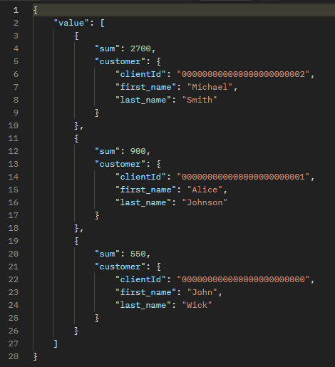
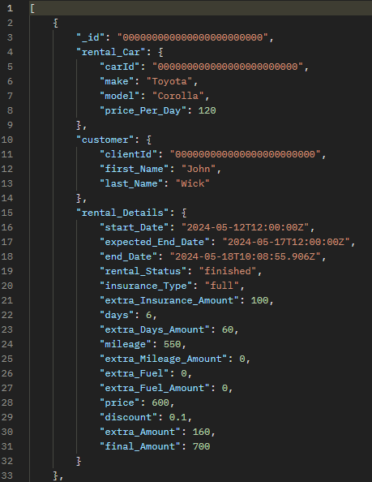
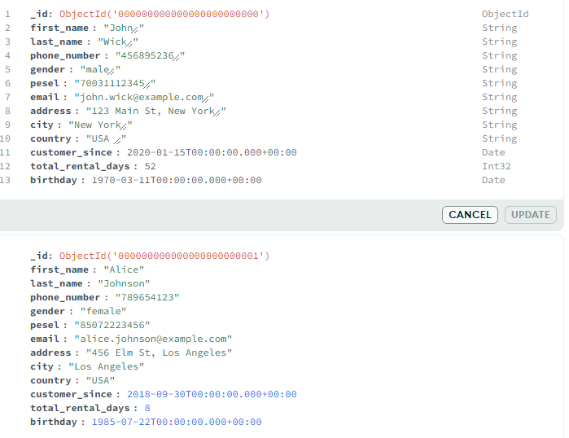

# Projekt systemu do wypożyczania aut
## Kluza Łukasz i Mateusz Sacha

### 1. Schemat Bazy Danych

#### 1.1 CarsModels



#### 1.2 Cars


#### 1.3 Clients




#### 1.4 Rentals


### Transakcje
Aby móc korzystać z transakcji musieliśmy odpowiednio skonfugurować nasz serwer bazodanywo.
 
W pliku konfiguracyjnym _mongo.cfg_ dodaliśmy zależnoć, która pozwala korzystać z __replication set__

```json
replication:
  replSetName: "rs0"
```

```
> rs.initiate()
```
oraz kontrolnie

```json
> rs.status()
```

```json
rs0 [direct: primary] test> rs.status()
{
  set: 'rs0',
  date: ISODate('2024-06-02T19:39:16.112Z'),
  myState: 1,
  term: Long('1'),
  syncSourceHost: '',
  syncSourceId: -1,
  heartbeatIntervalMillis: Long('2000'),
  majorityVoteCount: 1,
  writeMajorityCount: 1,
  votingMembersCount: 1,
  writableVotingMembersCount: 1,
  optimes: {
    lastCommittedOpTime: { ts: Timestamp({ t: 1717357155, i: 1 }), t: Long('1') },
    lastCommittedWallTime: ISODate('2024-06-02T19:39:15.353Z'),
    readConcernMajorityOpTime: { ts: Timestamp({ t: 1717357155, i: 1 }), t: Long('1') },
    appliedOpTime: { ts: Timestamp({ t: 1717357155, i: 1 }), t: Long('1') },
    durableOpTime: { ts: Timestamp({ t: 1717357155, i: 1 }), t: Long('1') },
    lastAppliedWallTime: ISODate('2024-06-02T19:39:15.353Z'),
    lastDurableWallTime: ISODate('2024-06-02T19:39:15.353Z')
  },
  lastStableRecoveryTimestamp: Timestamp({ t: 1717357137, i: 1 }),
  electionCandidateMetrics: {
    lastElectionReason: 'electionTimeout',
    lastElectionDate: ISODate('2024-06-01T10:25:44.170Z'),
    electionTerm: Long('1'),
    lastCommittedOpTimeAtElection: { ts: Timestamp({ t: 1717237544, i: 1 }), t: Long('-1') },
    lastSeenOpTimeAtElection: { ts: Timestamp({ t: 1717237544, i: 1 }), t: Long('-1') },
    numVotesNeeded: 1,
    priorityAtElection: 1,
    electionTimeoutMillis: Long('10000'),
    newTermStartDate: ISODate('2024-06-01T10:25:44.244Z'),
    wMajorityWriteAvailabilityDate: ISODate('2024-06-01T10:25:44.291Z')
  },
  members: [
    {
      _id: 0,
      name: '127.0.0.1:27017',
      health: 1,
      state: 1,
      stateStr: 'PRIMARY',
      uptime: 119743,
      optime: { ts: Timestamp({ t: 1717357155, i: 1 }), t: Long('1') },
      optimeDate: ISODate('2024-06-02T19:39:15.000Z'),
      lastAppliedWallTime: ISODate('2024-06-02T19:39:15.353Z'),
      lastDurableWallTime: ISODate('2024-06-02T19:39:15.353Z'),
      syncSourceHost: '',
      syncSourceId: -1,
      infoMessage: '',
      electionTime: Timestamp({ t: 1717237544, i: 2 }),
      electionDate: ISODate('2024-06-01T10:25:44.000Z'),
      configVersion: 1,
      configTerm: 1,
      self: true,
      lastHeartbeatMessage: ''
    }
  ],
  ok: 1,
  '$clusterTime': {
    clusterTime: Timestamp({ t: 1717357155, i: 1 }),
    signature: {
      hash: Binary.createFromBase64('AAAAAAAAAAAAAAAAAAAAAAAAAAA=', 0),
      keyId: Long('0')
    }
  },
  operationTime: Timestamp({ t: 1717357155, i: 1 })
}
```

### Testy

```sql
http://localhost:5000/api/Rental/Rentals/?maxExpectedEndDate=2024-05-21&maxExtraAmount=0
```

za dużo tekstu aby mi się na ss zmieściło xD

```sql
http://localhost:5000/api/Car/Cars?seats=5&color=black&minPower=200&maxPower=300&maxProductionYear= 2022
```


```sql
http://localhost:5000/api/Statistics/Rentals/10
```


```sql
http://localhost:5000/api/Statistics/Customers/10
```



```sql
http://localhost:5000/api/Statistics/Customers/Cars
```


```sql
http://localhost:5000/api/Client/Clients?minTotal_rental_days=30&minCustomerSince=2021-01-01&maxCustomerSince=2023-12-31
```

to też mi się nie zmieści xd

```sql
http://localhost:5000/api/Rental/NewRental
```

BODY:

```json
{
  "_id": 5,
  "customer": {
    "clientId": 2,
    "first_name": "Michael",
    "last_name": "Smith"
  },
  "rental_car": {
    "make": "Audi",
    "model": "Q5",
    "carId": 35,
    "price_per_day": 200
  },
  "rental_details": {
    "start_date": "2024-05-22T12:00:00.000Z",
    "expected_end_date": "2024-05-30T12:00:00.000Z",
    "end_date": null,
    "rental_status": "ongoing",
    "insurance_type": "basic",
    "extra_insurance_amount": 50,
    "days": 8,
    "extra_days_amount": 0,
    "mileage": 1200,
    "extra_mileage_amount": 0,
    "extra_fuel": 0,
    "extra_fuel_amount": 0,
    "price": 1600,
    "discount": 0,
    "extra_amount": 50,
    "final_amount": 1650
  }
}
```


```sql
http://localhost:5000/api/Rental/FinishRental/5
```

BODY response

```JSON
{
    "_id": 5,
    "rental_Car": {
        "carId": 35,
        "make": "Audi",
        "model": "Q5",
        "price_Per_Day": 200
    },
    "customer": {
        "clientId": 2,
        "first_Name": "Michael",
        "last_Name": "Smith"
    },
    "rental_Details": {
        "start_Date": "2024-05-22T12:00:00Z",
        "expected_End_Date": "2024-05-30T12:00:00Z",
        "end_Date": "2024-06-02T19:52:14.0237776Z",
        "rental_Status": "finished",
        "insurance_Type": "basic",
        "extra_Insurance_Amount": 50,
        "days": 12,
        "extra_Days_Amount": 400,
        "mileage": 1200,
        "extra_Mileage_Amount": 0,
        "extra_Fuel": 0,
        "extra_Fuel_Amount": 0,
        "price": 1600,
        "discount": 0,
        "extra_Amount": 450,
        "final_Amount": 2050
    }
}
```

