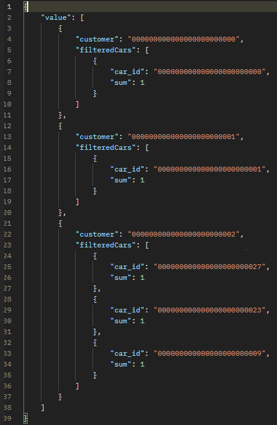
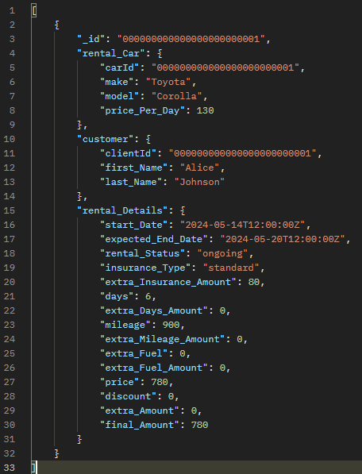

# Projekt systemu do wypożyczania aut
## Kluza Łukasz i Mateusz Sacha

### 1. Schemat Bazy Danych

#### 1.1 CarsModels


#### 1.2 Cars


#### 1.3 Clients




#### 1.4 Rentals


### 2. Opis Serwisów

#### 2.1
#### 2.2
#### 2.3
#### 2.4 Rental Service

##### 2.4.1 New Rental
Służy do asynchronicnzego tworzenia nowych wypożyczeń, zapytanie to jest stworzene w modelu transakcyjnym co oznacza, że wykonuje się ono albo w całości albo w ogóle.
Przyjmuje on jako parametr obiekt typu _Rental_ i ralizuje kolejne operacje

- Zarządza transakcjami
```csharp
using (var session = await _client.StartSessionAsync())
{
  session.StartTransaction();
  try
  {
    await session.CommitTransactionAsync();
  }
  catch (Exception ex)
  {
    await session.AbortTransactionAsync();
    throw;
  }
}      
```
- Sprawda czy obiekt _Rental_ nie jest nulem
```csharp
if (rental == null)
{
  _logger.LogError("Rental model is null");
  throw new ArgumentNullException(nameof(rental), "Rental model cannot be null");
}
```

- Sprawdza czy auto które chcemy wypozyczyć istnieje i jest dostępne: 
```csharp
Car car = await _carService.GetCarByIdAsync(carID);
if(car == null)
{
  _logger.LogWarning($"Car with ID '{carID}' not found.");
  throw new KeyNotFoundException($"Car does not exist.");
}
if(!car.IsAvailable)
{
  _logger.LogWarning($"Car with ID '{carID}' is not available.");
  throw new KeyNotFoundException($"Car does not available.");
}
```

- Aktualizuje status dostępności auta:
```csharp
var res = await _carService.UpdateCarAvailabilityByIdAsync(carID, false);
if (!res){
  _logger.LogWarning($"Error: UpdateCarAvailabilityByIdAsync()");
  throw new KeyNotFoundException($"Error: UpdateCarAvailabilityByIdAsync()");
}
```

- Jeśli żaden wyjątek nie został rzucony i wszystko pobiegło pomyślnie to dodaje obiek _rental_ do bazy:
```csharp
await _rentalCollection.InsertOneAsync(rental);
_logger.LogInformation("Rental model created successfully: {@Rental}", rental);
```

##### 2.4. Finish Rental
Służy do asynchronicnzego końcenia obecnych wypożyczeń, zapytanie to jest stworzene w modelu transakcyjnym co oznacza, że wykonuje się ono albo w całości albo w ogóle.
Przyjmuje on jako parametr _id_ wyporzyczenia które chcemy zakończyć oraz obiekt typu _Rental_ i ralizuje kolejne operacje

- Zarządza transakcjami:
```csharp
using (var session = await _client.StartSessionAsync())
{
  session.StartTransaction();
  try
  {
    await session.CommitTransactionAsync();
  }
  catch (Exception ex)
  {
    await session.AbortTransactionAsync();
    throw;
  }
}      
```

- Spraawdza czy wyporzyczenie, które chcemy zakończyć istnieje:
```csharp
var filter = Builders<Rental>.Filter.Eq(rental => rental._id, id);
var originalRental = await _rentalCollection.Find(filter).FirstOrDefaultAsync();

if (originalRental == null || rental == null)
{
  _logger.LogWarning($"Rental with ID '{id}' not found.");
  throw new KeyNotFoundException($"Rental does not exist.");
}
```
- Tworzy zmienne pomocnicze
```csharp
Rental_Details orginal_rental_Details = originalRental.Rental_Details;
Rental_Details rental_Details = rental.Rental_Details;
Rental_Car rental_Car = rental.Rental_Car;
```
- Ustawia datę zakończenia wypożyczenia na obecną, oblicza liczbę rozpoczętnych dni wypożyczenia, aktualizuje status na _sinished_

```csharp
rental_Details.End_Date = DateTime.UtcNow;
rental_Details.Days = (int)Math.Ceiling((rental_Details.End_Date.Value - rental_Details.Start_Date).TotalDays);
rental_Details.Rental_Status = "finished";
```

- Oblicza karę umowną za każdy dodatkowy dzień wypożyczenia (doliczane jest dodatkowe 50% dziennej opłaty za dane auto):

```csharp
if(rental_Details.Days > orginal_rental_Details.Days)
{
  rental_Details.Extra_Days_Amount = (int)((rental_Details.Days - orginal_rental_Details.Days) * 0.5 * rental_Car.Price_Per_Day);
  rental_Details.Extra_Amount += rental_Details.Extra_Days_Amount;
}
```
- Oblicza karę umowną za każdą dodatkowo przejechaną milę (doliczane jest dodatkowe 0.5% dziennej opłaty za dane auto do dodatkowej każdej mili powyżej 150 za dzień):

```csharp
if(rental_Details.Mileage > orginal_rental_Details.Mileage)
{
  rental_Details.Extra_Mileage_Amount = (int)((orginal_rental_Details.Mileage - rental_Details.Mileage) * 0.005 * rental_Car.Price_Per_Day);
  rental_Details.Extra_Mileage_Amount += rental_Details.Extra_Mileage_Amount;
}
```
- Oblicza karę umowną za każdy brakujący galon paliwa (wymagamy aby przy zwrocie bag był zatankowany do pełna, za każdy brakujący galon doliczamy 5$):

```csharp
if(rental_Details.Extra_Fuel != null)
{
  rental_Details.Extra_Fuel_Amount = rental_Details.Extra_Fuel.Value * 5;
  rental_Details.Extra_Amount += rental_Details.Extra_Fuel_Amount;
}
```

- Oblicza końcowy koszt wypozyczenia z uwzględnieniem rabatu:
```csharp
  rental_Details.Final_Amount = (int)(rental_Details.Price * (1-orginal_rental_Details.Discount) + rental_Details.Extra_Amount);
```

- Aktualizuje dostępność zwrócenego medelu auta oraz sprawdza poprawnośc wykonania się operacji:
```csharp
var res = await _carService.UpdateCarAvailabilityByIdAsync(rental_Car.carId, true);
if (!res)
{
  _logger.LogWarning($"Error: UpdateCarAvailabilityByIdAsync()");
  throw new KeyNotFoundException($"Error: UpdateCarAvailabilityByIdAsync()");
}
```

- Aktualizuje przebieg zwrócenego medelu auta oraz sprawdza poprawnośc wykonania się operacji:
```csharp
var mileageUpdate = await _carService.UpdateCurrentMileageAsync(rental_Car.carId, rental_Details.Mileage);
if (!res)
{
  _logger.LogWarning($"Error: UpdateCurrentMileageAsync()");
  throw new KeyNotFoundException($"Error: UpdateCurrentMileageAsync()");
}
```
- Aktulizuje liczbę dni wypożyczeń przez danego klienta:
```csharp
  var clientUpdate = await _clientService.UpdateRentalDaysAsync(rental.Customer.ClientId, rental_Details.Days);
```

- Aktualizuje obiekt _rental_:
```csharp
  var result = await _rentalCollection.ReplaceOneAsync(filter, rental);
```

##### 2.4.3 Get Rentals Per Filter
Jest to asynchroniczna funckja, która zwraca wypożyczenia pasujące do otrzymanego jako parametr filtra.
```csharp
public async Task<IEnumerable<Rental>> GetRentalsPerFilterAsync(FilterDefinition<Rental> filter)
{
  try
  {
    var result = await _rentalCollection.Find(filter).ToListAsync();
    return result;
  }
  catch (Exception ex)
  {
    _logger.LogError($"An error occurred while retrieving rentals: {ex.Message}");
    throw;
  }
}
```


### Transakcje
Aby móc korzystać z transakcji musieliśmy odpowiednio skonfugurować nasz serwer bazodanywo.
 
W pliku konfiguracyjnym _mongo.cfg_ dodaliśmy zależnoć, która pozwala korzystać z __replication set__

```json
replication:
  replSetName: "rs0"
```

```
> rs.initiate()
```
oraz kontrolnie

```json
> rs.status()
```

```json
rs0 [direct: primary] test> rs.status()
{
  set: 'rs0',
  date: ISODate('2024-06-02T19:39:16.112Z'),
  myState: 1,
  term: Long('1'),
  syncSourceHost: '',
  syncSourceId: -1,
  heartbeatIntervalMillis: Long('2000'),
  majorityVoteCount: 1,
  writeMajorityCount: 1,
  votingMembersCount: 1,
  writableVotingMembersCount: 1,
  optimes: {
    lastCommittedOpTime: { ts: Timestamp({ t: 1717357155, i: 1 }), t: Long('1') },
    lastCommittedWallTime: ISODate('2024-06-02T19:39:15.353Z'),
    readConcernMajorityOpTime: { ts: Timestamp({ t: 1717357155, i: 1 }), t: Long('1') },
    appliedOpTime: { ts: Timestamp({ t: 1717357155, i: 1 }), t: Long('1') },
    durableOpTime: { ts: Timestamp({ t: 1717357155, i: 1 }), t: Long('1') },
    lastAppliedWallTime: ISODate('2024-06-02T19:39:15.353Z'),
    lastDurableWallTime: ISODate('2024-06-02T19:39:15.353Z')
  },
  lastStableRecoveryTimestamp: Timestamp({ t: 1717357137, i: 1 }),
  electionCandidateMetrics: {
    lastElectionReason: 'electionTimeout',
    lastElectionDate: ISODate('2024-06-01T10:25:44.170Z'),
    electionTerm: Long('1'),
    lastCommittedOpTimeAtElection: { ts: Timestamp({ t: 1717237544, i: 1 }), t: Long('-1') },
    lastSeenOpTimeAtElection: { ts: Timestamp({ t: 1717237544, i: 1 }), t: Long('-1') },
    numVotesNeeded: 1,
    priorityAtElection: 1,
    electionTimeoutMillis: Long('10000'),
    newTermStartDate: ISODate('2024-06-01T10:25:44.244Z'),
    wMajorityWriteAvailabilityDate: ISODate('2024-06-01T10:25:44.291Z')
  },
  members: [
    {
      _id: 0,
      name: '127.0.0.1:27017',
      health: 1,
      state: 1,
      stateStr: 'PRIMARY',
      uptime: 119743,
      optime: { ts: Timestamp({ t: 1717357155, i: 1 }), t: Long('1') },
      optimeDate: ISODate('2024-06-02T19:39:15.000Z'),
      lastAppliedWallTime: ISODate('2024-06-02T19:39:15.353Z'),
      lastDurableWallTime: ISODate('2024-06-02T19:39:15.353Z'),
      syncSourceHost: '',
      syncSourceId: -1,
      infoMessage: '',
      electionTime: Timestamp({ t: 1717237544, i: 2 }),
      electionDate: ISODate('2024-06-01T10:25:44.000Z'),
      configVersion: 1,
      configTerm: 1,
      self: true,
      lastHeartbeatMessage: ''
    }
  ],
  ok: 1,
  '$clusterTime': {
    clusterTime: Timestamp({ t: 1717357155, i: 1 }),
    signature: {
      hash: Binary.createFromBase64('AAAAAAAAAAAAAAAAAAAAAAAAAAA=', 0),
      keyId: Long('0')
    }
  },
  operationTime: Timestamp({ t: 1717357155, i: 1 })
}
```

### Testy

```sql
http://localhost:5000/api/Rental/Rentals/?maxExpectedEndDate=2024-05-21&maxExtraAmount=0
```

za dużo tekstu aby mi się na ss zmieściło xD

```sql
http://localhost:5000/api/Car/Cars?seats=5&color=black&minPower=200&maxPower=300&maxProductionYear= 2022
```


```sql
http://localhost:5000/api/Statistics/Rentals/10
```


```sql
http://localhost:5000/api/Statistics/Customers/10
```


```sql
http://localhost:5000/api/Statistics/Customers/Cars
```


```sql
http://localhost:5000/api/Client/Clients?minTotal_rental_days=30&minCustomerSince=2021-01-01&maxCustomerSince=2023-12-31
```

to też mi się nie zmieści xd

```sql
http://localhost:5000/api/Rental/NewRental
```

BODY:

```json
{
  "_id": 5,
  "customer": {
    "clientId": 2,
    "first_name": "Michael",
    "last_name": "Smith"
  },
  "rental_car": {
    "make": "Audi",
    "model": "Q5",
    "carId": 35,
    "price_per_day": 200
  },
  "rental_details": {
    "start_date": "2024-05-22T12:00:00.000Z",
    "expected_end_date": "2024-05-30T12:00:00.000Z",
    "end_date": null,
    "rental_status": "ongoing",
    "insurance_type": "basic",
    "extra_insurance_amount": 50,
    "days": 8,
    "extra_days_amount": 0,
    "mileage": 1200,
    "extra_mileage_amount": 0,
    "extra_fuel": 0,
    "extra_fuel_amount": 0,
    "price": 1600,
    "discount": 0,
    "extra_amount": 50,
    "final_amount": 1650
  }
}
```




```sql
http://localhost:5000/api/Rental/FinishRental/5
```

BODY response

```JSON
{
    "_id": 5,
    "rental_Car": {
        "carId": 35,
        "make": "Audi",
        "model": "Q5",
        "price_Per_Day": 200
    },
    "customer": {
        "clientId": 2,
        "first_Name": "Michael",
        "last_Name": "Smith"
    },
    "rental_Details": {
        "start_Date": "2024-05-22T12:00:00Z",
        "expected_End_Date": "2024-05-30T12:00:00Z",
        "end_Date": "2024-06-02T19:52:14.0237776Z",
        "rental_Status": "finished",
        "insurance_Type": "basic",
        "extra_Insurance_Amount": 50,
        "days": 12,
        "extra_Days_Amount": 400,
        "mileage": 1200,
        "extra_Mileage_Amount": 0,
        "extra_Fuel": 0,
        "extra_Fuel_Amount": 0,
        "price": 1600,
        "discount": 0,
        "extra_Amount": 450,
        "final_Amount": 2050
    }
}
```

